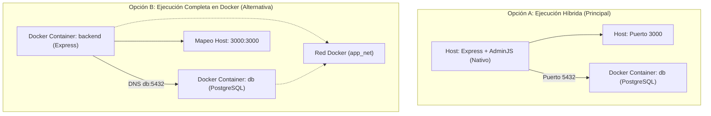
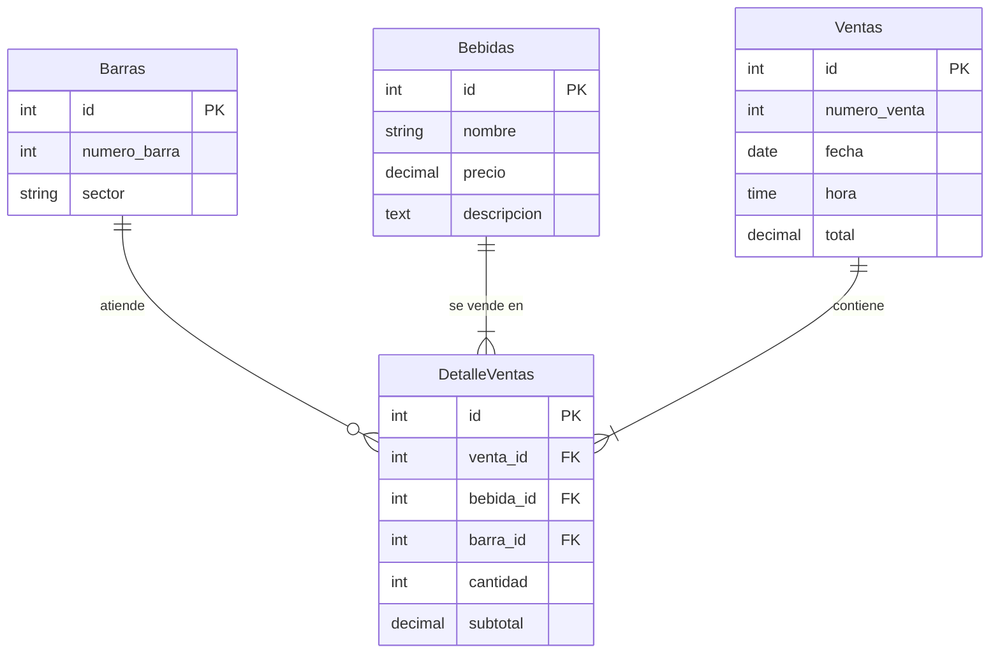

# Tutorial: Despliegue de una Aplicación Express con Docker


**Mantenido Por:** Grupo 7

## Índice
- [Introducción](#introducción)
  - [Tabla de equivalencias](#tabla-de-equivalencias)
  - [Diagramas de Arquitectura y Base de Datos](#diagramas-de-arquitectura-y-base-de-datos)
- [Requisitos Previos](#requisitos-previos)
- [Automatización del Proyecto (Instalación Rápida)](#automatización-del-proyecto-instalación-rápida)
  - [Setup automático completo (`setup-project.js`)](#setup-automático-completo-setup-projectjs)
  - [Arranque manual paso a paso (`dev-start.js`)](#arranque-manual-paso-a-paso-dev-startjs)
- [1. Estructura del Proyecto](#1-estructura-del-proyecto)
- [2. Definición de Dependencias](#2-definición-de-dependencias)
- [3. Creación del Dockerfile](#3-creación-del-dockerfile)
- [4. Configuración de Variables de Entorno](#4-configuración-de-variables-de-entorno)
- [5. Configuración de Sequelize CLI](#5-configuración-de-sequelize-cli)
- [6. Definición de Servicios con Docker Compose](#6-definición-de-servicios-con-docker-compose)
- [7. Configuración Base del Servidor](#7-configuración-base-del-servidor)
  - [Configuración de la base de datos (`src/config/database.cjs`)](#configuración-de-la-base-de-datos-srcconfigdatabasecjs)
  - [Aplicación principal (`src/app.js`)](#aplicación-principal-srcappjs)
  - [Vista Pública del Cliente (`src/public/index.html`)](#vista-pública-del-cliente-srcpublicindexhtml)
- [8. Modelado de la Aplicación (Sequelize ESM)](#8-modelado-de-la-aplicación-sequelize-esm)
- [9. Configuración y Customización de AdminJS (Vercel Style)](#9-configuración-y-customización-de-adminjs-vercel-style)
  - [Configuración del Panel (`src/admin/index.js`)](#configuración-del-panel-srcadminindexjs)
  - [Componente de Branding (`src/admin/components/custom-sidebar-branding.jsx`)](#componente-de-branding-srcadmincomponentscustom-sidebar-brandingjsx)
  - [Componente de Footer del Sidebar (`src/admin/components/custom-sidebar-footer.jsx`)](#componente-de-footer-del-sidebar-srcadmincomponentscustom-sidebar-footerjsx)
  - [Componente Barra de Navegación Superior (`src/admin/components/custom-top-bar.jsx`)](#componente-barra-de-navegación-superior-srcadmincomponentscustom-top-barjsx)
  - [Componente del Dashboard (`src/admin/components/dashboard.jsx`)](#componente-del-dashboard-srcadmincomponentsdashboardjsx)
  - [Hoja de Estilos de Personalización (`src/public/css/admin-custom.css`)](#hoja-de-estilos-de-personalización-srcpubliccssadmin-customcss)
- [10. Migraciones y Datos de Semilla (Seeders)](#10-migraciones-y-datos-de-semilla-seeders)
  - [Archivo de migración (`src/migrations/001-initial.js`)](#archivo-de-migración-srcmigrations001-initialjs)
    - [Migración de Sesiones (`src/migrations/002-sessions.js`)](#migración-de-sesiones-srcmigrations002-sessionsjs)
- [Seeder de Datos Completos (`src/seeders/001-initial-data.js`)](#seeder-de-datos-completos-srcseeders001-initial-datajs)
- [11. Ejecución del Proyecto](#11-ejecución-del-proyecto)
- [12. Resolución de Errores Conocidos](#12-resolución-de-errores-conocidos)
- [13. Comandos Útiles de Mantenimiento](#13-comandos-útiles-de-mantenimiento)
- [Conclusión](#conclusión)

---

## Introducción
Este tutorial te guiará paso a paso en la creación y despliegue de una aplicación Express de gestión de bar utilizando Docker y Docker Compose. El objetivo es que puedas levantar un entorno de desarrollo profesional, portable y fácil de mantener, ideal tanto para pruebas como para producción. Es el equivalente directo del tutorial de Django, reemplazando cada pieza con su contraparte en el ecosistema Node.js (utilizando ES Modules y diseño custom premium Vercel Black Technical).

### Tabla de equivalencias

| Django | Express |
|--------|---------|
| `requirements.txt` | `package.json` |
| `Django` | `Express` + `Sequelize` |
| `psycopg[binary]` | `pg` + `pg-hstore` |
| `gunicorn` | `node src/app.js` |
| `django-admin startproject` | script de scaffolding |
| `manage.py migrate` | `npx sequelize-cli db:migrate` |
| `manage.py makemigrations` | `npx sequelize-cli migration:generate` |
| `manage.py loaddata` | `npx sequelize-cli db:seed:all` |
| `manage.py createsuperuser` | variables de entorno (`ADMIN_EMAIL`, `ADMIN_PASSWORD`) |
| `models.py` | `src/models/*.js` (Sequelize) |
| `admin.py` + panel `/admin/` | `src/admin/index.js` (AdminJS) |

### Diagramas de Arquitectura y Base de Datos

#### Arquitectura de Ejecución

El siguiente diagrama detalla la diferencia entre la **Opción A (Ejecución Principal Híbrida/Nativa)** y la **Opción B (Ejecución Completa en Docker)**:



#### Diagrama de Entidad-Relación (Base de Datos)

Las relaciones entre los modelos del bar (Sequelize) se estructuran según el siguiente diagrama entidad-relación:




## Requisitos Previos
- **Docker** y **Docker Compose** instalados en tu sistema. Puedes consultar la [documentación oficial de Docker](https://docs.docker.com/get-docker/) para la instalación.
- Conocimientos básicos de JavaScript, React y Node.js.

### Recursos Útiles
- [Documentación oficial de Express](https://expressjs.com/)
- [Documentación de Sequelize](https://sequelize.org/docs/v6/)
- [Documentación de AdminJS](https://docs.adminjs.co/)

---

## Automatización del Proyecto (Instalación Rápida)

Se proporcionan dos scripts de automatización en la raíz del proyecto. Ambos detectan automáticamente si Docker corre de forma nativa en el host o dentro de WSL, y adaptan todos los comandos al entorno correcto.

---

### Setup automático completo (`setup-project.js`)

Genera todos los archivos del proyecto desde cero, levanta Docker, ejecuta las migraciones y siembra la base de datos en un único comando. Ideal para la primera puesta en marcha.

**¿Qué hace?**
1. **Genera carpetas y código** — crea `src/config`, `src/models`, `src/admin/components`, etc. y escribe todos los archivos (`app.js`, modelos, componentes React, estilos CSS).
2. **Detecta Docker** — comprueba el host; si no lo encuentra, busca en WSL default y luego en WSL Arch Linux.
3. **Levanta PostgreSQL** en Docker y espera el healthcheck.
4. **Instala dependencias** Node.js (`npm install`) en el mismo entorno donde corre Docker.
5. **Migra y siembra** la base de datos automáticamente.

**Cómo ejecutarlo:**

En Windows (PowerShell):
```powershell
./setup.ps1
```

En macOS / Linux / WSL:
```bash
chmod +x setup.sh
./setup.sh
```

Universal (cualquier sistema con Node.js):
```bash
node setup-project.js
```

Al finalizar, solo hace falta iniciar la app:
```bash
cd fabrica
npm start
```

*(Asegurate de tener Docker Desktop iniciado antes de correr el script).*

---

### Arranque manual paso a paso (`dev-start.js`)

Útil cuando los archivos **ya están generados** y solo necesitás levantar el entorno de desarrollo. Automatiza lo que siempre es igual (Docker + dependencias) y te deja a vos los pasos que pueden variar (migración, semilla, inicio).

#### ¿Qué hace?

1. **Detecta la plataforma** donde se ejecuta Node.js: Windows, macOS, Linux o WSL.
2. **Localiza Docker** según la plataforma:
   - **Windows**: prueba Docker Desktop nativo; si falla, busca dentro de WSL (default y luego Arch Linux).
   - **macOS / Linux / WSL**: Docker siempre es local; si no responde, muestra el comando para iniciarlo.
3. **Calcula la ruta WSL** del proyecto (via `wslpath`) solo cuando se ejecuta en Windows y Docker está en WSL.
4. **Levanta el contenedor `db`** con `docker compose up -d db`.
5. **Espera el healthcheck** de PostgreSQL con reintentos y mensajes de estado.
6. **Instala dependencias** Node.js en el entorno correcto.
7. **Imprime los comandos exactos** de migración, semilla e inicio adaptados a la plataforma — no los ejecuta.

#### Cómo ejecutarlo

```bash
node dev-start.js
```

#### Comportamiento por plataforma

| Plataforma | Docker buscado en | Comandos mostrados |
|------------|------------------|--------------------|
| Windows + Docker Desktop | Host nativo | `cd "C:\...\fabrica" && npx sequelize-cli ...` |
| Windows + Docker en WSL | WSL default / Arch | `wsl bash -c "cd '/mnt/...' && npx ..."` |
| macOS | Docker Desktop local | `cd "/ruta/fabrica" && npx sequelize-cli ...` |
| Linux nativo | Daemon local | `cd "/ruta/fabrica" && npx sequelize-cli ...` |
| WSL | Daemon dentro de WSL | `cd "/mnt/.../fabrica" && npx sequelize-cli ...` |

> El script detecta automáticamente en cuál de estos casos estás y adapta todos los comandos. Solo copiá y pegá lo que imprime al finalizar.

**Cuándo usar cada script:**

| Situación | Script recomendado |
|-----------|-------------------|
| Primera vez, proyecto vacío | `setup-project.js` |
| Archivos ya generados, levantar entorno | `dev-start.js` |
| Solo cambié código, quiero reiniciar | `cd fabrica && npm start` |
| Quiero correr todo en Docker | `docker compose up -d` (ver Opción C) |

---

### Cómo ejecutar los scripts en cada plataforma

| Plataforma | Comando |
|------------|---------|
| Windows (PowerShell) | `./setup.ps1` o `node setup-project.js` |
| macOS / Linux | `./setup.sh` o `node setup-project.js` |
| WSL | `./setup.sh` o `node setup-project.js` |
| Arranque manual | `node dev-start.js` |

---

## 1. Estructura del Proyecto
Crea la carpeta para tu proyecto. En este ejemplo, la llamaremos `app`. La estructura final esperada de archivos y carpetas del backend es la siguiente:

```text
app/
├── src/
│   ├── admin/
│   │   ├── components/
│   │   │   ├── custom-sidebar-branding.jsx
│   │   │   ├── custom-sidebar-footer.jsx
│   │   │   ├── custom-top-bar.jsx
│   │   │   └── dashboard.jsx
│   │   └── index.js
│   ├── config/
│   │   └── database.cjs
│   ├── migrations/
│   │   ├── 001-initial.js
│   │   └── 002-sessions.js
│   ├── models/
│   │   ├── index.js
│   │   ├── barra.js
│   │   ├── bebida.js
│   │   ├── detalleventa.js
│   │   └── venta.js
│   ├── public/
│   │   ├── css/
│   │   │   └── admin-custom.css
│   │   └── index.html
│   ├── seeders/
│   │   └── 001-initial-data.js
│   └── app.js
├── .dockerignore
├── .env.db
├── .sequelizerc
├── Dockerfile
└── docker-compose.yml
```

> **Puedes copiar todo este bloque y pegarlo directamente en tu terminal.**
```sh
mkdir -p app/src/admin/components app/src/config app/src/migrations app/src/models app/src/public/css app/src/seeders
cd app/
```

---

## 2. Definición de Dependencias
Crea el archivo `package.json` con soporte para ES Modules (`"type": "module"`) y todas las dependencias necesarias para Express, AdminJS (React, styled-components y el sistema de diseño) y Sequelize.

> **Puedes copiar todo este bloque y pegarlo directamente en tu archivo package.json.**
```json
{
  "name": "bar",
  "version": "1.0.0",
  "description": "Sistema de gestión de bar — bebidas, barras y ventas",
  "type": "module",
  "main": "src/app.js",
  "scripts": {
    "start": "node src/app.js"
  },
  "dependencies": {
    "adminjs": "^7.8.13",
    "@adminjs/express": "^6.1.0",
    "@adminjs/sequelize": "^4.1.1",
    "connect-session-sequelize": "^7.1.7",
    "dotenv": "^16.3.1",
    "express": "^4.18.2",
    "express-formidable": "^1.2.0",
    "express-session": "^1.17.3",
    "pg": "^8.11.3",
    "pg-hstore": "^2.3.4",
    "sequelize": "^6.35.2",
    "react": "^18.2.0",
    "react-dom": "^18.2.0",
    "styled-components": "^5.3.6",
    "@adminjs/design-system": "^3.0.0"
  },
  "devDependencies": {
    "sequelize-cli": "^6.6.2"
  }
}
```

---

## 3. Creación del Dockerfile
El `Dockerfile` define la imagen de Docker que contendrá tu aplicación. Usa una construcción en múltiples etapas con Node.js Alpine.

> **Puedes copiar todo este bloque y pegarlo directamente en tu archivo Dockerfile.**
```dockerfile
# Etapa base
FROM node:22-alpine AS base
LABEL maintainer="Desarrollador <soporte@ejemplo.com>"
LABEL version="1.0"
LABEL description="sistema de gestión de bar"
RUN apk --no-cache add bash curl

# Etapa de construcción
FROM base AS builder
WORKDIR /build
COPY package*.json ./
RUN npm ci --omit=dev

# Etapa de producción
FROM base
RUN mkdir /code
WORKDIR /code
COPY package*.json ./
COPY --from=builder /build/node_modules ./node_modules
RUN ln -s /usr/share/zoneinfo/America/Cordoba /etc/localtime

CMD ["node", "src/app.js"]
```

También se recomienda crear un archivo `.dockerignore` para evitar copiar carpetas pesadas:
```text
node_modules
npm-debug.log
.git
```

---

## 4. Configuración de Variables de Entorno
Crea el archivo `.env.db` con las variables para la base de datos y el panel de administración.

> **Puedes copiar todo este bloque y pegarlo directamente en tu archivo .env.db.**
```conf
#######################################################################
# .env.db
# Datos para la conexion desde Express a la base de datos de postgres
POSTGRES_HOST=db
POSTGRES_PORT=5432
POSTGRES_DB=postgres
POSTGRES_USER=postgres
PGUSER=${POSTGRES_USER}
POSTGRES_PASSWORD=${POSTGRES_USER}
LANG=es_AR.utf8
POSTGRES_INITDB_ARGS="--locale-provider=icu --icu-locale=es-AR --auth-local=trust"
POSTGRES_HOST_AUTH_METHOD=scram-sha-256
# Credenciales del panel de administración (equivalente a createsuperuser)
ADMIN_EMAIL=admin@bar.example
ADMIN_PASSWORD=admin123
# Puerto del servidor Express
PORT=3000
```

---

## 5. Configuración de Sequelize CLI
Crea el archivo `.sequelizerc` en la raíz del proyecto para indicarle a `sequelize-cli` dónde están los archivos de modelos, migraciones y seeders. Dado que el proyecto usa ES Modules, el archivo de configuración de la base de datos debe guardarse con extensión `.cjs` para que Sequelize CLI pueda ejecutarlo como CommonJS.

> **Puedes copiar todo este bloque y pegarlo directamente en tu archivo .sequelizerc.**
```js
// .sequelizerc
const path = require('path');

module.exports = {
  'config': path.resolve('src/config', 'database.cjs'),
  'models-path': path.resolve('src', 'models'),
  'seeders-path': path.resolve('src', 'seeders'),
  'migrations-path': path.resolve('src', 'migrations'),
};
```

---

## 6. Definición de Servicios con Docker Compose
El archivo `docker-compose.yml` orquesta los servicios: base de datos, backend Express, scaffold inicial y utilidades de gestión.

> **Puedes copiar todo este bloque y pegarlo directamente en tu archivo docker-compose.yml.**
```yml
services:
  db:
    image: postgres:alpine
    env_file:
      - .env.db
    healthcheck:
      test: [ "CMD-SHELL", "pg_isready" ]
      interval: 10s
      timeout: 2s
      retries: 5
    volumes:
      - postgres-db:/var/lib/postgresql
    networks:
      - net

  backend:
    build: .
    command: node src/app.js
    env_file:
      - .env.db
    ports:
      - "3000:3000"
    volumes:
      - ./src:/code/src
    depends_on:
      db:
        condition: service_healthy
    networks:
      - net

  generate:
    build: .
    user: root
    command: >
      /bin/sh -c '
        mkdir -p src/config src/models src/migrations src/seeders src/routes src/admin &&
        echo "Estructura del proyecto generada exitosamente en ./src/"
      '
    env_file:
      - .env.db
    volumes:
      - .:/code
    networks:
      - net

  manage:
    build: .
    entrypoint: npx sequelize-cli
    env_file:
      - .env.db
    volumes:
      - ./src:/code/src
      - ./.sequelizerc:/code/.sequelizerc
    depends_on:
      db:
        condition: service_healthy
    networks:
      - net

networks:
  net:

volumes:
  postgres-db:
```

---

## 7. Configuración Base del Servidor

### Configuración de la base de datos (`src/config/database.cjs`)
Equivalente al bloque `DATABASES` en `settings.py` de Django. Se crea con extensión CommonJS `.cjs` para garantizar la compatibilidad con Sequelize CLI.

> **Puedes copiar todo este bloque y pegarlo directamente en tu archivo ./src/config/database.cjs.**
```js
// src/config/database.cjs
require('dotenv').config();

const config = {
  username: process.env.POSTGRES_USER || 'postgres',
  password: process.env.POSTGRES_PASSWORD || 'postgres',
  database: process.env.POSTGRES_DB || 'postgres',
  host: process.env.POSTGRES_HOST || 'localhost',
  port: parseInt(process.env.POSTGRES_PORT || '5432'),
  dialect: 'postgres',
  logging: false,
};

module.exports = {
  development: config,
  production: config,
};
```

### Aplicación principal (`src/app.js`)
Equivalente al `wsgi.py` / `urls.py` de Django. Se implementa usando sintaxis ESM. Además de construir el panel de administración de AdminJS, sirve archivos estáticos de la carpeta `src/public` para renderizar el home.

> **Puedes copiar todo este bloque y pegarlo directamente en tu archivo ./src/app.js.**
```js
// src/app.js
import 'dotenv/config';
import { fileURLToPath } from 'url';
import { dirname, join } from 'path';
import express from 'express';
import session from 'express-session';
import ConnectSessionSequelize from 'connect-session-sequelize';
import AdminJS from 'adminjs';
import AdminJSExpress from '@adminjs/express';
import AdminJSSequelize from '@adminjs/sequelize';

const { sequelize } = await import('./models/index.js');
import adminConfig from './admin/index.js';

const __dirname = dirname(fileURLToPath(import.meta.url));

AdminJS.registerAdapter(AdminJSSequelize);

const app = express();
const PORT = process.env.PORT || 3000;

const SequelizeStore = ConnectSessionSequelize(session.Store);
const sessionStore = new SequelizeStore({ db: sequelize });

const start = async () => {
  try {
    const adminJs = new AdminJS(adminConfig);
    await sessionStore.sync();

    const adminRouter = AdminJSExpress.buildAuthenticatedRouter(
      adminJs,
      {
        authenticate: async (email, password) => {
          if (
            email === process.env.ADMIN_EMAIL &&
            password === process.env.ADMIN_PASSWORD
          ) {
            return { email };
          }
          return null;
        },
        cookieName: 'adminjs',
        cookiePassword: process.env.ADMIN_PASSWORD || 'secreto-cambiar-en-produccion',
      },
      null,
      {
        store: sessionStore,
        resave: false,
        saveUninitialized: true,
        secret: process.env.ADMIN_PASSWORD || 'secreto-cambiar-en-produccion',
      }
    );

    app.use(adminJs.options.rootPath, adminRouter);
    app.use(express.static(join(__dirname, 'public')));

    app.get('/', (req, res) => {
      res.sendFile(join(__dirname, 'public', 'index.html'));
    });

    await sequelize.authenticate();
    app.listen(PORT, '0.0.0.0', () => {
      console.log(`Servidor corriendo en http://localhost:${PORT}`);
      console.log(`Panel de administración en http://localhost:${PORT}/admin`);
    });
  } catch (err) {
    console.error('Error durante el inicio del servidor:', err.message);
    console.error(err);
    process.exit(1);
  }
};

start();
```

---

### Vista Pública del Cliente (`src/public/index.html`)

El proyecto incluye una página de inicio (Landing Page) moderna y minimalista con diseño oscuro premium, animaciones interactivas (efecto Spotlight Hover) y accesos directos al panel de administración. El archivo completo es autogenerado por los scripts de automatización en `src/public/index.html`.

A continuación se detallan las partes clave de su implementación:

#### 1. Sistema de Tokens de Diseño (CSS Variables)
Define una paleta consistente con el panel AdminJS (negros profundos, bordes semitransparentes y acento azul):
```html
<!-- Fragmento de src/public/index.html -->
<!DOCTYPE html>
<html lang="es" data-theme="dark">
<head>
  <meta charset="UTF-8" />
  <meta name="viewport" content="width=device-width, initial-scale=1.0" />
  <title>Fábrica — Gestión de Piezas y Herramientas</title>
  <style>
    :root {
      --bg-base:    #080808;
      --bg-surface: #101010;
      --bg-card:    #161616;
      --bg-elevated:#1e1e1e;
      --border:       rgba(255,255,255,0.07);
      --border-hover: rgba(255,255,255,0.13);
      --text-primary:   #ebebeb;
      --text-secondary: #888;
      --accent:       #5b8af5;
      --radius-lg: 14px;
      --ease:   cubic-bezier(0.16,1,0.3,1);
    }
    /* Reset y Estilos Generales... */
  </style>
</head>
```

#### 2. Efecto Interactivo Spotlight Hover (JavaScript)
Registra las coordenadas del cursor dentro de las tarjetas del catálogo para proyectar un foco de luz dinámico que las sigue con suavidad:
```html
<!-- Fragmento de src/public/index.html -->
<script>
  // Efecto de spotlight interactivo en las tarjetas
  document.querySelectorAll('.card').forEach(card => {
    card.addEventListener('mousemove', e => {
      const r = card.getBoundingClientRect();
      card.style.setProperty('--mx', `${e.clientX - r.left}px`);
      card.style.setProperty('--my', `${e.clientY - r.top}px`);
    });
  });

  // Filtros interactivos del catálogo
  document.querySelectorAll('.feed__filter').forEach(btn => {
    btn.addEventListener('click', () => {
      btn.closest('.feed__filters').querySelectorAll('.feed__filter').forEach(b => b.classList.remove('active'));
      btn.classList.add('active');
    });
  });
</script>
```

---

## 8. Modelado de la Aplicación (Sequelize ESM)

### Cargador central (`src/models/index.js`)
Inicialización de Sequelize, carga manual de los modelos estructurada para soportar ES Modules e importación del archivo de base de datos `.cjs`, estableciendo las asociaciones entre entidades (equivalente a los campos `ForeignKey` y relaciones de Django).

> **Puedes copiar todo este bloque y pegarlo directamente en tu archivo ./src/models/index.js.**
```js
// src/models/index.js
import { Sequelize, DataTypes } from 'sequelize';
import path from 'path';
import { fileURLToPath } from 'url';
import dbConfig from '../config/database.cjs';

const __filename = fileURLToPath(import.meta.url);
const __dirname = path.dirname(__filename);

const env = process.env.NODE_ENV || 'development';
const config = dbConfig[env];

const sequelize = new Sequelize(
  config.database,
  config.username,
  config.password,
  config
);

// Importaciones manuales para garantizar consistencia con ES Modules
import BarraModel      from './barra.js';
import BebidaModel     from './bebida.js';
import VentaModel      from './venta.js';
import DetalleVentaModel from './detalleventa.js';

const Barra       = BarraModel(sequelize, DataTypes);
const Bebida      = BebidaModel(sequelize, DataTypes);
const Venta       = VentaModel(sequelize, DataTypes);
const DetalleVenta = DetalleVentaModel(sequelize, DataTypes);

// Asociaciones
Venta.hasMany(DetalleVenta, { foreignKey: 'venta_id', as: 'Detalle' });
DetalleVenta.belongsTo(Venta, { foreignKey: 'venta_id', as: 'Venta' });

DetalleVenta.belongsTo(Bebida, { foreignKey: 'bebida_id', as: 'Bebida' });
Bebida.hasMany(DetalleVenta, { foreignKey: 'bebida_id', as: 'Detalle' });

DetalleVenta.belongsTo(Barra, { foreignKey: 'barra_id', as: 'Barra' });
Barra.hasMany(DetalleVenta, { foreignKey: 'barra_id', as: 'Detalle' });

export {
  sequelize,
  Sequelize,
  Barra,
  Bebida,
  Venta,
  DetalleVenta,
};
```

A continuación se detallan los 4 archivos de modelos individuales de la aplicación, implementados con formato ESM (`export default`):

### `src/models/barra.js`
```js
// src/models/barra.js
'use strict';
export default (sequelize, DataTypes) => {
  const Barra = sequelize.define('Barra', {
    numero_barra: {
      type: DataTypes.INTEGER,
      allowNull: false,
    },
    sector: {
      type: DataTypes.STRING(200),
      allowNull: false,
    },
  }, {
    tableName: 'barras',
    timestamps: false,
  });
  return Barra;
};
```

### `src/models/bebida.js`
```js
// src/models/bebida.js
'use strict';
export default (sequelize, DataTypes) => {
  const Bebida = sequelize.define('Bebida', {
    nombre: {
      type: DataTypes.STRING(200),
      allowNull: false,
    },
    precio: {
      type: DataTypes.DECIMAL(15, 2),
      allowNull: false,
      defaultValue: 0,
    },
    descripcion: {
      type: DataTypes.TEXT,
      allowNull: true,
    },
  }, {
    tableName: 'bebidas',
    timestamps: false,
    hooks: {
      beforeSave: (instance) => {
        if (instance.nombre) instance.nombre = instance.nombre.toUpperCase();
      },
    },
  });
  return Bebida;
};
```

### `src/models/venta.js`
```js
// src/models/venta.js
'use strict';
export default (sequelize, DataTypes) => {
  const Venta = sequelize.define('Venta', {
    numero_venta: {
      type: DataTypes.INTEGER,
      allowNull: false,
    },
    fecha: {
      type: DataTypes.DATEONLY,
      allowNull: false,
    },
    hora: {
      type: DataTypes.TIME,
      allowNull: false,
    },
    total: {
      type: DataTypes.DECIMAL(15, 2),
      allowNull: false,
      defaultValue: 0,
    },
  }, {
    tableName: 'ventas',
    timestamps: false,
  });
  return Venta;
};
```

### `src/models/detalleventa.js`
```js
// src/models/detalleventa.js
'use strict';
export default (sequelize, DataTypes) => {
  const DetalleVenta = sequelize.define('DetalleVenta', {
    venta_id: {
      type: DataTypes.INTEGER,
      allowNull: false,
    },
    bebida_id: {
      type: DataTypes.INTEGER,
      allowNull: false,
    },
    barra_id: {
      type: DataTypes.INTEGER,
      allowNull: false,
    },
    cantidad: {
      type: DataTypes.INTEGER,
      allowNull: false,
      defaultValue: 1,
    },
    subtotal: {
      type: DataTypes.DECIMAL(15, 2),
      allowNull: false,
      defaultValue: 0,
    },
  }, {
    tableName: 'detalle_ventas',
    timestamps: false,
  });
  return DetalleVenta;
};
```

---

## 9. Configuración y Customización de AdminJS (Vercel Style)

Para brindar una experiencia visual de alto nivel, el panel de administración de AdminJS está configurado para anular componentes predeterminados e implementar un tema técnico oscuro (Vercel Black) con transiciones suaves, tarjetas escalables al pasar el cursor y un diseño unificado global.

### Configuración del Panel (`src/admin/index.js`)
En este archivo registramos los recursos de Sequelize con mapeos de referencias de claves foráneas explícitos (`properties: { campo_id: { reference: 'NombreRecurso' } }`) para evitar errores en las relaciones y configuramos las fuentes y overrides.

> **Puedes copiar todo este bloque y pegarlo directamente en tu archivo ./src/admin/index.js.**
```js
// src/admin/index.js
import { fileURLToPath } from 'url';
import { dirname, join } from 'path';
import { ComponentLoader } from 'adminjs';
import {
  UnidadMedida,
  Componente,
  Barrio,
  Localidad,
  Provincia,
  Pieza,
  Cliente,
  Venta,
  DetalleVenta,
  Ensamblaje,
} from '../models/index.js';

const __filename = fileURLToPath(import.meta.url);
const __dirname = dirname(__filename);

const componentLoader = new ComponentLoader();

componentLoader.override('SidebarBranding', join(__dirname, 'components', 'custom-sidebar-branding.jsx'));
componentLoader.override('SidebarFooter',   join(__dirname, 'components', 'custom-sidebar-footer.jsx'));
componentLoader.override('TopBar',          join(__dirname, 'components', 'custom-top-bar.jsx'));

const Components = {
  Dashboard: componentLoader.add('Dashboard', join(__dirname, 'components', 'dashboard.jsx')),
};

// Handler de borrado que captura errores de FK y los muestra como toast legible
const safeDelete = async (request, response, context) => {
  const { record, resource, h, currentAdmin } = context;
  try {
    await record.delete(currentAdmin);
    return {
      record: record.toJSON(currentAdmin),
      redirectUrl: h.resourceUrl({ resourceId: resource.id() }),
      notice: { message: 'Registro eliminado correctamente.', type: 'success' },
    };
  } catch (err) {
    const isFk = err.original?.code === '23503' || err.message?.includes('foreign key');
    const msg = isFk
      ? 'No se puede eliminar: el registro está siendo usado por otros datos (clave foránea).'
      : `Error al eliminar: ${err.message}`;
    return {
      record: record.toJSON(currentAdmin),
      notice: { message: msg, type: 'error' },
    };
  }
};

const deleteAction = {
  guard: '¿Estás seguro que querés eliminar este registro? Esta acción no se puede deshacer.',
  handler: safeDelete,
};

export default {
  rootPath: '/admin',
  componentLoader,
  dashboard: {
    component: Components.Dashboard,
  },
  resources: [
    // ── Maestros ───────────────────────────────────────────────────────────────
    {
      resource: UnidadMedida,
      options: {
        id: 'UnidadMedida',
        navigation: { name: 'Maestros', icon: 'Ruler' },
        listProperties:   ['id', 'nombre'],
        showProperties:   ['id', 'nombre'],
        editProperties:   ['nombre'],
        createProperties: ['nombre'],
        sort: { sortBy: 'nombre', direction: 'asc' },
        properties: {
          nombre: { isRequired: true },
        },
        actions: { delete: deleteAction },
      },
    },
    {
      resource: Componente,
      options: {
        id: 'Componente',
        navigation: { name: 'Maestros', icon: 'Cpu' },
        listProperties:   ['id', 'nombre', 'costo', 'unidad_medida_id'],
        showProperties:   ['id', 'nombre', 'costo', 'unidad_medida_id'],
        editProperties:   ['nombre', 'costo', 'unidad_medida_id'],
        createProperties: ['nombre', 'costo', 'unidad_medida_id'],
        sort: { sortBy: 'nombre', direction: 'asc' },
        searchableProperties: ['nombre'],
        properties: {
          nombre:           { isRequired: true },
          costo:            { isRequired: true },
          unidad_medida_id: { isRequired: true, reference: 'UnidadMedida' },
        },
        actions: { delete: deleteAction },
      },
    },

    // ── Geografía ──────────────────────────────────────────────────────────────
    {
      resource: Barrio,
      options: {
        id: 'Barrio',
        navigation: { name: 'Geografía', icon: 'Location' },
        listProperties:   ['id', 'nombre'],
        showProperties:   ['id', 'nombre'],
        editProperties:   ['nombre'],
        createProperties: ['nombre'],
        sort: { sortBy: 'nombre', direction: 'asc' },
        properties: {
          nombre: { isRequired: true },
        },
        actions: { delete: deleteAction },
      },
    },
    {
      resource: Localidad,
      options: {
        id: 'Localidad',
        navigation: { name: 'Geografía', icon: 'Location' },
        listProperties:   ['id', 'nombre'],
        showProperties:   ['id', 'nombre'],
        editProperties:   ['nombre'],
        createProperties: ['nombre'],
        sort: { sortBy: 'nombre', direction: 'asc' },
        properties: {
          nombre: { isRequired: true },
        },
        actions: { delete: deleteAction },
      },
    },
    {
      resource: Provincia,
      options: {
        id: 'Provincia',
        navigation: { name: 'Geografía', icon: 'Location' },
        listProperties:   ['id', 'nombre'],
        showProperties:   ['id', 'nombre'],
        editProperties:   ['nombre'],
        createProperties: ['nombre'],
        sort: { sortBy: 'nombre', direction: 'asc' },
        properties: {
          nombre: { isRequired: true },
        },
        actions: { delete: deleteAction },
      },
    },

    // ── Producción ─────────────────────────────────────────────────────────────
    {
      resource: Pieza,
      options: {
        id: 'Pieza',
        navigation: { name: 'Producción', icon: 'Tool' },
        listProperties:   ['id', 'nombre', 'ganancia', 'es_herramienta'],
        showProperties:   ['id', 'nombre', 'ganancia', 'es_herramienta'],
        editProperties:   ['nombre', 'ganancia', 'es_herramienta'],
        createProperties: ['nombre', 'ganancia', 'es_herramienta'],
        sort: { sortBy: 'nombre', direction: 'asc' },
        searchableProperties: ['nombre'],
        filterProperties:     ['nombre', 'es_herramienta'],
        properties: {
          nombre:   { isRequired: true },
          ganancia: { isRequired: true },
        },
        actions: {
          delete: deleteAction,
          duplicate: {
            actionType: 'record',
            icon: 'Copy',
            label: 'Duplicar',
            handler: async (request, response, context) => {
              const { record, resource, h } = context;
              const { id, ...data } = record.params;
              await resource.create({ ...data, nombre: `${data.nombre} (COPIA)` });
              return {
                redirectUrl: h.resourceUrl({ resourceId: resource.id() }),
                notice: { message: 'Pieza duplicada con éxito', type: 'success' },
              };
            },
          },
        },
      },
    },
    {
      resource: Ensamblaje,
      options: {
        id: 'Ensamblaje',
        navigation: { name: 'Producción', icon: 'Settings' },
        listProperties:   ['id', 'pieza_id', 'componente_id', 'cantidad'],
        showProperties:   ['id', 'pieza_id', 'componente_id', 'cantidad'],
        editProperties:   ['pieza_id', 'componente_id', 'cantidad'],
        createProperties: ['pieza_id', 'componente_id', 'cantidad'],
        sort: { sortBy: 'componente_id', direction: 'asc' },
        properties: {
          cantidad:      { isRequired: true },
          pieza_id:      { isRequired: true, reference: 'Pieza' },
          componente_id: { isRequired: true, reference: 'Componente' },
        },
        actions: { delete: deleteAction },
      },
    },

    // ── Clientes ───────────────────────────────────────────────────────────────
    {
      resource: Cliente,
      options: {
        id: 'Cliente',
        navigation: { name: 'Clientes', icon: 'User' },
        listProperties:   ['id', 'nombre', 'numero_documento', 'email', 'celular'],
        showProperties:   ['id', 'nombre', 'numero_documento', 'direccion', 'celular', 'telefono', 'email', 'barrio_id', 'localidad_id', 'provincia_id'],
        editProperties:   ['nombre', 'numero_documento', 'direccion', 'celular', 'telefono', 'email', 'barrio_id', 'localidad_id', 'provincia_id'],
        createProperties: ['nombre', 'numero_documento', 'direccion', 'celular', 'telefono', 'email', 'barrio_id', 'localidad_id', 'provincia_id'],
        sort: { sortBy: 'nombre', direction: 'asc' },
        searchableProperties: ['nombre', 'email'],
        filterProperties:     ['localidad_id', 'provincia_id'],
        properties: {
          nombre:       { isRequired: true },
          barrio_id:    { reference: 'Barrio' },
          localidad_id: { reference: 'Localidad' },
          provincia_id: { reference: 'Provincia' },
        },
        actions: { delete: deleteAction },
      },
    },

    // ── Ventas ─────────────────────────────────────────────────────────────────
    {
      resource: Venta,
      options: {
        id: 'Venta',
        navigation: { name: 'Ventas', icon: 'ShoppingCart' },
        listProperties:   ['id', 'fecha', 'cliente_id'],
        showProperties:   ['id', 'fecha', 'cliente_id'],
        editProperties:   ['fecha', 'cliente_id'],
        createProperties: ['fecha', 'cliente_id'],
        sort: { sortBy: 'fecha', direction: 'asc' },
        filterProperties: ['fecha', 'cliente_id'],
        properties: {
          fecha:      { isRequired: true },
          cliente_id: { isRequired: true, reference: 'Cliente' },
        },
        actions: {
          delete: deleteAction,
          generateReceipt: {
            actionType: 'record',
            icon: 'FileText',
            label: 'Generar Recibo',
            handler: async (request, response, context) => {
              return {
                notice: { message: 'Recibo generado correctamente (simulado)', type: 'success' },
              };
            },
          },
        },
      },
    },
    {
      resource: DetalleVenta,
      options: {
        id: 'DetalleVenta',
        navigation: { name: 'Ventas', icon: 'List' },
        listProperties:   ['id', 'venta_id', 'pieza_id', 'cantidad'],
        showProperties:   ['id', 'venta_id', 'pieza_id', 'cantidad'],
        editProperties:   ['venta_id', 'pieza_id', 'cantidad'],
        createProperties: ['venta_id', 'pieza_id', 'cantidad'],
        properties: {
          venta_id: { isRequired: true, reference: 'Venta' },
          pieza_id: { isRequired: true, reference: 'Pieza' },
        },
        actions: { delete: deleteAction },
      },
    },
  ],
  branding: {
    companyName: 'Fábrica',
    logo: false,
    favicon: '',
    withMadeWithLove: false,
    theme: {
      colors: {
        bg: '#080808',
        container: '#101010',
        sidebar: '#101010',
        filterBg: '#101010',
        border: 'rgba(255,255,255,0.07)',
        inputBorder: 'rgba(255,255,255,0.07)',
        separator: 'rgba(255,255,255,0.07)',
        text: '#ebebeb',
        grey100: '#ebebeb',
        grey80: '#ebebeb',
        grey60: '#888888',
        grey40: '#555555',
        grey20: '#161616',
        primary100: '#5b8af5',
        primary80: '#7a9ff7',
        primary60: '#93b3f9',
        primary40: '#b8ccfb',
        primary20: '#dce8fd',
        accent: '#5b8af5',
        white: '#080808',
        black: '#080808',
        love: '#5b8af5',
        error: '#f56565',
        errorLight: 'rgba(245,101,101,0.12)',
      },
      borderRadius: '10px',
      font: "'Inter', -apple-system, BlinkMacSystemFont, 'Segoe UI', sans-serif",
    },
  },
  assets: {
    styles: [
      'https://fonts.googleapis.com/css2?family=Inter:wght@300;400;500;600;700&display=swap',
      '/css/admin-custom.css',
    ],
  },
  locale: {
    language: 'es',
    translations: {
      es: {
        actions: {
          new: 'Crear',
          edit: 'Editar',
          show: 'Ver',
          delete: 'Eliminar',
          list: 'Listar',
          duplicate: 'Duplicar',
          generateReceipt: 'Generar Recibo',
        },
        buttons: {
          save: 'Guardar',
          addNewItem: 'Agregar',
          filter: 'Filtrar',
          applyChanges: 'Aplicar',
          resetFilter: 'Resetear',
          confirmRemovalMany: 'Confirmar eliminación de {{count}} registro(s)',
          logout: 'Cerrar sesión',
        },
        messages: {
          thereWereValidationErrors: 'Completá los campos obligatorios antes de guardar.',
        },
      },
    },
  },
};
export { componentLoader };
```

A continuación se definen los archivos de componentes de React personalizados registrados en el `componentLoader`:

### Componente de Branding (`src/admin/components/custom-sidebar-branding.jsx`)
Dibuja el nombre de la compañía con un indicador minimalista azul y animaciones en hover.

> **Puedes copiar todo este bloque y pegarlo en ./src/admin/components/custom-sidebar-branding.jsx.**
```jsx
import React from 'react'
import styled from 'styled-components'

const Brand = styled.a`
  display: flex;
  align-items: center;
  gap: 8px;
  padding: 18px 20px 14px;
  text-decoration: none;
  border-bottom: 1px solid rgba(255,255,255,0.07);
  margin-bottom: 4px;
  transition: opacity 150ms ease;

  &:hover { opacity: 0.8; }
`

const Mark = styled.div`
  width: 26px;
  height: 26px;
  background: #5b8af5;
  border-radius: 6px;
  display: grid;
  place-items: center;
  flex-shrink: 0;
`

const Name = styled.span`
  color: #ebebeb;
  font-size: 15px;
  font-weight: 600;
  letter-spacing: -0.2px;
`

const CustomSidebarBranding = () => (
  <Brand href="/admin">
    <Mark>
      <svg width="14" height="14" viewBox="0 0 14 14" fill="none">
        <rect x="1" y="1" width="5" height="5" rx="1" fill="white" fillOpacity="0.9"/>
        <rect x="8" y="1" width="5" height="5" rx="1" fill="white" fillOpacity="0.5"/>
        <rect x="1" y="8" width="5" height="5" rx="1" fill="white" fillOpacity="0.5"/>
        <rect x="8" y="8" width="5" height="5" rx="1" fill="white" fillOpacity="0.3"/>
      </svg>
    </Mark>
    <Name>Fábrica</Name>
  </Brand>
)

export default CustomSidebarBranding
```

### Componente de Footer del Sidebar (`src/admin/components/custom-sidebar-footer.jsx`)
Oculta el footer predeterminado de AdminJS para lograr una interfaz completamente limpia.

> **Puedes copiar todo este bloque y pegarlo en ./src/admin/components/custom-sidebar-footer.jsx.**
```jsx
import React from 'react'

const CustomSidebarFooter = () => {
  return null
}

export default CustomSidebarFooter
```

### Componente Barra de Navegación Superior (`src/admin/components/custom-top-bar.jsx`)
Barra superior global fija con enlaces rápidos a las secciones principales, botón de menú adaptable a móviles y botón de salida.

> **Puedes copiar todo este bloque y pegarlo en ./src/admin/components/custom-top-bar.jsx.**
```jsx
import React from 'react'
import styled from 'styled-components'
import { useSelector } from 'react-redux'

const Bar = styled.div`
  position: fixed;
  top: 0; left: 0; right: 0;
  height: 64px;
  z-index: 9999;
  background: rgba(8,8,8,0.92);
  backdrop-filter: blur(16px);
  -webkit-backdrop-filter: blur(16px);
  border-bottom: 1px solid rgba(255,255,255,0.07);
  display: flex;
  align-items: center;
  justify-content: space-between;
  padding: 0 1.25rem;
  box-sizing: border-box;
  font-family: 'Inter', -apple-system, BlinkMacSystemFont, 'Segoe UI', sans-serif;
`

const Left = styled.div`
  display: flex;
  align-items: center;
  gap: 4px;
`

const Logo = styled.a`
  display: flex;
  align-items: center;
  gap: 8px;
  font-size: 15px;
  font-weight: 600;
  letter-spacing: -0.2px;
  color: #ebebeb;
  text-decoration: none;
  margin-right: 24px;
  flex-shrink: 0;
  &:hover { opacity: 0.8; }
`

const Mark = styled.div`
  width: 26px;
  height: 26px;
  background: #5b8af5;
  border-radius: 6px;
  display: grid;
  place-items: center;
  flex-shrink: 0;
`

const NavLinks = styled.nav`
  display: flex;
  align-items: center;
  gap: 2px;
  @media (max-width: 768px) { display: none; }
`

const NavBtn = styled.button`
  padding: 6px 12px;
  border-radius: 6px;
  font-size: 14px;
  color: #888;
  background: transparent;
  border: none;
  cursor: pointer;
  font-family: inherit;
  font-weight: 450;
  letter-spacing: -0.1px;
  transition: color 150ms ease, background 150ms ease;
  &:hover { color: #ebebeb; background: #1e1e1e; }
`

const Right = styled.div`
  display: flex;
  align-items: center;
  gap: 8px;
`

const BtnOutline = styled.a`
  font-size: 13.5px;
  font-weight: 500;
  font-family: inherit;
  cursor: pointer;
  display: inline-flex;
  align-items: center;
  gap: 5px;
  padding: 6px 14px;
  border-radius: 6px;
  transition: all 150ms ease;
  white-space: nowrap;
  text-decoration: none;
  color: #888;
  border: 1px solid rgba(255,255,255,0.07);
  background: transparent;
  &:hover { color: #ebebeb; border-color: rgba(255,255,255,0.13); background: #1e1e1e; }
`

const BtnSolid = styled.button`
  font-size: 13.5px;
  font-weight: 500;
  font-family: inherit;
  cursor: pointer;
  display: inline-flex;
  align-items: center;
  gap: 5px;
  padding: 6px 14px;
  border-radius: 6px;
  transition: all 150ms ease;
  white-space: nowrap;
  color: #ebebeb;
  border: 1px solid rgba(255,255,255,0.13);
  background: transparent;
  &:hover { background: #1e1e1e; }
`

const CustomTopBar = (props) => {
  const { toggleSidebar } = props
  const paths = useSelector((state) => state.paths)

  const go = (id) => { window.location.href = `/admin/resources/${id}` }
  const logout = () => { window.location.href = paths?.logoutPath || '/admin/logout' }

  return (
    <Bar>
      <Left>
        <Logo href="/admin">
          <Mark>
            <svg width="14" height="14" viewBox="0 0 14 14" fill="none">
              <rect x="1" y="1" width="5" height="5" rx="1" fill="white" fillOpacity="0.9"/>
              <rect x="8" y="1" width="5" height="5" rx="1" fill="white" fillOpacity="0.5"/>
              <rect x="1" y="8" width="5" height="5" rx="1" fill="white" fillOpacity="0.5"/>
              <rect x="8" y="8" width="5" height="5" rx="1" fill="white" fillOpacity="0.3"/>
            </svg>
          </Mark>
          Fábrica
        </Logo>

        <NavLinks>
          <NavBtn onClick={() => go('UnidadMedida')}>Maestros</NavBtn>
          <NavBtn onClick={() => go('Pieza')}>Producción</NavBtn>
          <NavBtn onClick={() => go('Cliente')}>Clientes</NavBtn>
          <NavBtn onClick={() => go('Venta')}>Ventas</NavBtn>
        </NavLinks>
      </Left>

      <Right>
        <BtnOutline href="/">← Inicio</BtnOutline>
        <BtnSolid onClick={logout}>Salir</BtnSolid>
      </Right>
    </Bar>
  )
}

export default CustomTopBar
```

### Componente del Dashboard (`src/admin/components/dashboard.jsx`)
Dashboard interactivo que realiza peticiones a la API del panel mediante `ApiClient` para mostrar los contadores en tiempo real (clientes, ventas, componentes, piezas) y accesos directos rápidos con animaciones Vercel.

> **Puedes copiar todo este bloque y pegarlo en ./src/admin/components/dashboard.jsx.**
```jsx
import React, { useState, useEffect } from 'react'
import styled from 'styled-components'
import { ApiClient } from 'adminjs'

/* ── tokens (match index.html + admin-custom.css) ── */
const T = {
  bg:      '#080808',
  surface: '#101010',
  card:    '#161616',
  border:  'rgba(255,255,255,0.07)',
  borderH: 'rgba(255,255,255,0.13)',
  text:    '#ebebeb',
  muted:   '#888888',
  dim:     '#555555',
  accent:  '#5b8af5',
  green:   '#3ecf8e',
  red:     '#f56565',
  ease:    'cubic-bezier(0.16,1,0.3,1)',
}

/* ── layout ── */
const Page = styled.div`
  font-family: 'Inter', -apple-system, BlinkMacSystemFont, 'Segoe UI', sans-serif;
  color: ${T.text};
  padding: 2.5rem 0;
`

/* ── hero ── */
const HeroLabel = styled.p`
  font-size: 12px;
  font-weight: 500;
  letter-spacing: 1.2px;
  text-transform: uppercase;
  color: ${T.accent};
  margin: 0 0 12px;
`

const HeroTitle = styled.h1`
  font-size: clamp(1.8rem, 3vw, 2.5rem);
  font-weight: 700;
  letter-spacing: -0.04em;
  margin: 0 0 10px;
  color: ${T.text};
`

const HeroSub = styled.p`
  font-size: 1rem;
  color: ${T.muted};
  line-height: 1.6;
  margin: 0 0 2.5rem;
  max-width: 580px;
`

const Divider = styled.hr`
  border: none;
  border-top: 1px solid ${T.border};
  margin: 0 0 2.5rem;
`

/* ── stats grid ── */
const StatsGrid = styled.div`
  display: grid;
  grid-template-columns: repeat(4, 1fr);
  gap: 1rem;
  margin-bottom: 3rem;
  @media (max-width: 1024px) { grid-template-columns: repeat(2, 1fr); }
  @media (max-width: 600px)  { grid-template-columns: 1fr; }
`

const StatCard = styled.div`
  background: ${T.card};
  border: 1px solid ${T.border};
  border-radius: 10px;
  padding: 1.4rem 1.5rem;
  transition: border-color 180ms ${T.ease}, transform 180ms ${T.ease};
  cursor: default;
  &:hover {
    border-color: ${T.borderH};
    transform: translateY(-1px);
  }
`

const StatLabel = styled.span`
  font-size: 11px;
  font-weight: 500;
  letter-spacing: 0.7px;
  text-transform: uppercase;
  color: ${T.dim};
  display: block;
  margin-bottom: 8px;
`

const StatValue = styled.div`
  font-size: 2rem;
  font-weight: 700;
  letter-spacing: -0.04em;
  color: ${T.text};
  line-height: 1;
  margin-bottom: 6px;
`

const StatDesc = styled.div`
  font-size: 12.5px;
  color: ${T.muted};
`

/* ── section heading ── */
const SectionTitle = styled.h2`
  font-size: 1rem;
  font-weight: 500;
  letter-spacing: -0.1px;
  color: ${T.muted};
  margin: 0 0 1.25rem;
`

/* ── resource grid ── */
const ResourceGrid = styled.div`
  display: grid;
  grid-template-columns: repeat(3, 1fr);
  gap: 1rem;
  @media (max-width: 1024px) { grid-template-columns: repeat(2, 1fr); }
  @media (max-width: 600px)  { grid-template-columns: 1fr; }
`

const ResourceCard = styled.div`
  background: ${T.card};
  border: 1px solid ${T.border};
  border-radius: 10px;
  padding: 1.5rem;
  cursor: pointer;
  transition: border-color 180ms ${T.ease}, transform 180ms ${T.ease}, background 180ms ${T.ease};
  display: flex;
  flex-direction: column;
  gap: 12px;
  &:hover {
    border-color: ${T.borderH};
    background: #1a1a1a;
    transform: translateY(-2px);
  }
`

const CardIcon = styled.div`
  width: 36px;
  height: 36px;
  background: #1a1a1a;
  border: 1px solid ${T.border};
  border-radius: 8px;
  display: flex;
  align-items: center;
  justify-content: center;
  font-size: 14px;
  font-weight: 700;
  color: ${T.muted};
  letter-spacing: -0.5px;
  flex-shrink: 0;
`

const CardName = styled.div`
  font-size: 14px;
  font-weight: 600;
  color: ${T.text};
  letter-spacing: -0.1px;
`

const CardArrow = styled.div`
  font-size: 13px;
  color: ${T.dim};
  margin-top: auto;
  transition: color 180ms ${T.ease};
  ${ResourceCard}:hover & { color: ${T.muted}; }
`

/* ── component ── */
const Dashboard = () => {
  const [stats, setStats] = useState({ piezas: 0, componentes: 0, clientes: 0, ventas: 0, loading: true })

  useEffect(() => {
    const api = new ApiClient()
    Promise.all([
      api.resourceAction({ resourceId: 'Pieza',      actionName: 'list' }),
      api.resourceAction({ resourceId: 'Componente', actionName: 'list' }),
      api.resourceAction({ resourceId: 'Cliente',    actionName: 'list' }),
      api.resourceAction({ resourceId: 'Venta',      actionName: 'list' }),
    ]).then(([p, c, cl, v]) => {
      setStats({
        piezas:      p.data.meta.total  || 0,
        componentes: c.data.meta.total  || 0,
        clientes:    cl.data.meta.total || 0,
        ventas:      v.data.meta.total  || 0,
        loading: false,
      })
    }).catch(() => setStats(s => ({ ...s, loading: false })))
  }, [])

  const resources = [
    { id: 'UnidadMedida', name: 'Unidades de Medida', icon: 'UM' },
    { id: 'Componente',   name: 'Componentes',         icon: 'CO' },
    { id: 'Barrio',       name: 'Barrios',              icon: 'BA' },
    { id: 'Localidad',    name: 'Localidades',          icon: 'LO' },
    { id: 'Provincia',    name: 'Provincias',           icon: 'PR' },
    { id: 'Pieza',        name: 'Piezas',               icon: 'PI' },
    { id: 'Ensamblaje',   name: 'Ensamblajes',          icon: 'EN' },
    { id: 'Cliente',      name: 'Clientes',             icon: 'CL' },
    { id: 'Venta',        name: 'Ventas',               icon: 'VE' },
    { id: 'DetalleVenta', name: 'Detalle de Ventas',    icon: 'DV' },
  ]

  const go = (id) => { window.location.href = `/admin/resources/${id}` }
  const n = (v) => stats.loading ? '—' : v

  return (
    <Page>
      <HeroLabel>Panel de control</HeroLabel>
      <HeroTitle>Panel de Administración</HeroTitle>
      <HeroSub>Gestiona los recursos, el inventario, la fabricación y los clientes de tu fábrica.</HeroSub>
      <Divider />

      <StatsGrid>
        <StatCard>
          <StatLabel>Piezas</StatLabel>
          <StatValue>{n(stats.piezas)}</StatValue>
          <StatDesc>Productos y herramientas</StatDesc>
        </StatCard>
        <StatCard>
          <StatLabel>Componentes</StatLabel>
          <StatValue>{n(stats.componentes)}</StatValue>
          <StatDesc>Materia prima</StatDesc>
        </StatCard>
        <StatCard>
          <StatLabel>Clientes</StatLabel>
          <StatValue>{n(stats.clientes)}</StatValue>
          <StatDesc>Cartera comercial</StatDesc>
        </StatCard>
        <StatCard>
          <StatLabel>Ventas</StatLabel>
          <StatValue>{n(stats.ventas)}</StatValue>
          <StatDesc>Transacciones registradas</StatDesc>
        </StatCard>
      </StatsGrid>

      <SectionTitle>Recursos del sistema</SectionTitle>
      <ResourceGrid>
        {resources.map((r) => (
          <ResourceCard key={r.id} onClick={() => go(r.id)}>
            <CardIcon>{r.icon}</CardIcon>
            <CardName>{r.name}</CardName>
            <CardArrow>Abrir →</CardArrow>
          </ResourceCard>
        ))}
      </ResourceGrid>
    </Page>
  )
}

export default Dashboard
```

### Hoja de Estilos de Personalización (`src/public/css/admin-custom.css`)
Este archivo CSS anula de forma contundente los estilos de AdminJS (inputs, botones, tablas, barras de scroll e indicador de login) para unificarlos bajo el color negro (#000000) e Inter.

> **Puedes copiar todo este bloque y pegarlo en ./src/public/css/admin-custom.css.**
```css
/* ═══════════════════════════════════════════════════════════════════════════
   FÁBRICA ADMIN — Design tokens matching localhost:3000/
   ═══════════════════════════════════════════════════════════════════════════ */

/* ── Tokens ──────────────────────────────────────────────────────────────── */
:root {
  --adm-bg:       #080808;
  --adm-surface:  #101010;
  --adm-card:     #161616;
  --adm-elevated: #1e1e1e;
  --adm-hover:    #242424;

  --adm-border:       rgba(255,255,255,0.07);
  --adm-border-h:     rgba(255,255,255,0.13);
  --adm-border-focus: rgba(91,138,245,0.45);

  --adm-text:   #ebebeb;
  --adm-muted:  #888888;
  --adm-dim:    #555555;

  --adm-accent: #5b8af5;
  --adm-adim:   rgba(91,138,245,0.12);

  --adm-green:  #3ecf8e;
  --adm-amber:  #f5a623;
  --adm-red:    #f56565;

  --adm-r-sm:  6px;
  --adm-r-md:  10px;
  --adm-r-lg:  14px;
  --adm-r-xl:  20px;

  --adm-shadow-sm: 0 2px 8px rgba(0,0,0,0.55);
  --adm-shadow-md: 0 4px 20px rgba(0,0,0,0.65);
  --adm-shadow-lg: 0 12px 40px rgba(0,0,0,0.75);

  --adm-ease: cubic-bezier(0.16,1,0.3,1);
  --adm-fast: 150ms;
}

/* ── Font (Google Fonts loaded via assets.styles in admin/index.js) ───────── */
html, body, #adminjs, #app {
  font-family: 'Inter', -apple-system, BlinkMacSystemFont, 'Segoe UI', sans-serif !important;
  background: var(--adm-bg) !important;
  color: var(--adm-text) !important;
  -webkit-font-smoothing: antialiased !important;
}

/* ── Scrollbar ───────────────────────────────────────────────────────────── */
::-webkit-scrollbar       { width: 5px; height: 5px; }
::-webkit-scrollbar-track { background: transparent; }
::-webkit-scrollbar-thumb { background: rgba(255,255,255,0.10); border-radius: 3px; }
::-webkit-scrollbar-thumb:hover { background: rgba(255,255,255,0.18); }
::selection { background: var(--adm-adim); color: var(--adm-text); }

/* ── Headings ────────────────────────────────────────────────────────────── */
h1, h2, h3, h4, h5, h6,
[data-css="h1"], [data-css="h2"], [data-css="h3"], [data-css="h4"],
.adminjs_H1, .adminjs_H2, .adminjs_H3, .adminjs_H4 {
  font-family: 'Inter', sans-serif !important;
  color: var(--adm-text) !important;
  letter-spacing: -0.3px !important;
}

/* muted text */
[data-css="breadcrumbs"] span,
[data-css="breadcrumbs"] a,
[data-css="caption"],
.adminjs_Text[color="grey60"],
.adminjs_Text[color="grey40"] {
  color: var(--adm-muted) !important;
  font-size: 13px !important;
}
[data-css="breadcrumbs"] a:hover { color: var(--adm-accent) !important; }

/* ── Sidebar ─────────────────────────────────────────────────────────────── */
[data-css="sidebar"],
.adminjs_Sidebar {
  background: var(--adm-surface) !important;
  border-right: 1px solid var(--adm-border) !important;
  box-shadow: none !important;
  position: fixed !important;
  top: 0 !important;
  left: 0 !important;
  width: 280px !important;
  height: 100vh !important;
  padding-top: 64px !important;
  overflow-y: auto !important;
  overflow-x: hidden !important;
  z-index: 100 !important;
  box-sizing: border-box !important;
}

[data-css="sidebar-resources"],
.adminjs_SidebarResources {
  background: transparent !important;
}

/* sidebar section header */
[data-css="sidebar"] [data-css="caption"],
[data-css="nav-group-label"] {
  color: var(--adm-dim) !important;
  font-size: 10.5px !important;
  font-weight: 500 !important;
  letter-spacing: 0.8px !important;
  text-transform: uppercase !important;
  padding: 14px 20px 4px !important;
  display: block !important;
}

/* sidebar nav links */
[data-css="sidebar"] a,
[data-css="sidebar-resources"] a,
[data-css="sidebar"] button {
  color: var(--adm-muted) !important;
  font-size: 13.5px !important;
  font-weight: 450 !important;
  padding: 7px 14px !important;
  margin: 1px 10px !important;
  border-radius: var(--adm-r-sm) !important;
  transition: color var(--adm-fast) var(--adm-ease),
              background var(--adm-fast) var(--adm-ease) !important;
  display: flex !important;
  align-items: center !important;
  gap: 10px !important;
  text-decoration: none !important;
  background: transparent !important;
  border: none !important;
}

[data-css="sidebar"] a:hover,
[data-css="sidebar-resources"] a:hover,
[data-css="sidebar"] button:hover {
  color: var(--adm-text) !important;
  background: var(--adm-elevated) !important;
}

[data-css="sidebar"] a[aria-current="page"],
[data-css="sidebar-resources"] a.active {
  color: var(--adm-text) !important;
  background: var(--adm-elevated) !important;
  font-weight: 500 !important;
}

/* ── TopBar ──────────────────────────────────────────────────────────────── */
[data-css="top-bar"],
[data-css="topbar"],
.adminjs_TopBar {
  position: fixed !important;
  top: 0 !important;
  left: 0 !important;
  right: 0 !important;
  height: 64px !important;
  z-index: 200 !important;
  background: rgba(8,8,8,0.90) !important;
  backdrop-filter: blur(16px) !important;
  -webkit-backdrop-filter: blur(16px) !important;
  border-bottom: 1px solid var(--adm-border) !important;
  box-shadow: none !important;
  display: flex !important;
  align-items: center !important;
}

/* ── App Content ─────────────────────────────────────────────────────────── */
[data-css="app-content"] {
  margin-top: 64px !important;
  margin-left: 280px !important;
  background: var(--adm-bg) !important;
  min-height: calc(100vh - 64px) !important;
  padding: 28px 32px !important;
  box-sizing: border-box !important;
}

/* ── Page wrapper — color only on explicitly styled elements ─────────────── */
[data-css="section"] {
  background: transparent !important;
  border-color: var(--adm-border) !important;
}

/* ── Table wrapper ───────────────────────────────────────────────────────── */
[data-css="table-wrapper"],
[data-css="records-table-wrapper"],
.adminjs_TableWrapper {
  background: var(--adm-card) !important;
  border: 1px solid var(--adm-border) !important;
  border-radius: var(--adm-r-lg) !important;
  overflow: hidden !important;
}

/* ── Table ───────────────────────────────────────────────────────────────── */
table {
  width: 100% !important;
  border-collapse: collapse !important;
  background: transparent !important;
}

thead tr {
  background: var(--adm-surface) !important;
  border-bottom: 1px solid var(--adm-border) !important;
}

thead th {
  color: var(--adm-dim) !important;
  font-size: 11px !important;
  font-weight: 500 !important;
  letter-spacing: 0.7px !important;
  text-transform: uppercase !important;
  padding: 11px 16px !important;
  border: none !important;
  background: transparent !important;
  white-space: nowrap !important;
  font-family: 'Inter', sans-serif !important;
}

tbody tr {
  border-bottom: 1px solid var(--adm-border) !important;
  transition: background var(--adm-fast) var(--adm-ease) !important;
}
tbody tr:last-child { border-bottom: none !important; }
tbody tr:hover      { background: var(--adm-elevated) !important; }

tbody td {
  color: var(--adm-text) !important;
  font-size: 13.5px !important;
  padding: 11px 16px !important;
  border: none !important;
  background: transparent !important;
  font-family: 'Inter', sans-serif !important;
}

/* ── Form labels ─────────────────────────────────────────────────────────── */
label,
[data-css="label"],
[data-css="input-label"] {
  color: var(--adm-muted) !important;
  font-size: 13px !important;
  font-weight: 500 !important;
  margin-bottom: 5px !important;
  display: block !important;
  font-family: 'Inter', sans-serif !important;
}

/* ── Inputs / Textarea / Select ──────────────────────────────────────────── */
input[type="text"],
input[type="email"],
input[type="number"],
input[type="password"],
input[type="search"],
input[type="date"],
input[type="tel"],
input[type="url"],
select,
textarea {
  background: var(--adm-surface) !important;
  border: 1px solid var(--adm-border) !important;
  border-radius: var(--adm-r-sm) !important;
  color: var(--adm-text) !important;
  font-size: 14px !important;
  font-family: 'Inter', sans-serif !important;
  outline: none !important;
  transition: border-color var(--adm-fast),
              box-shadow var(--adm-fast) !important;
}

input:hover, select:hover, textarea:hover {
  border-color: var(--adm-border-h) !important;
}
input:focus, select:focus, textarea:focus {
  border-color: var(--adm-accent) !important;
  box-shadow: 0 0 0 3px var(--adm-border-focus) !important;
}
input::placeholder, textarea::placeholder { color: var(--adm-dim) !important; }

/* ── Buttons ─────────────────────────────────────────────────────────────── */
[data-css="button"][data-variant="primary"],
[data-variant="primary"],
button[type="submit"] {
  background: var(--adm-text) !important;
  color: var(--adm-bg) !important;
  border: none !important;
  border-radius: var(--adm-r-sm) !important;
  font-family: 'Inter', sans-serif !important;
  font-weight: 600 !important;
  transition: all var(--adm-fast) var(--adm-ease) !important;
}
[data-variant="primary"]:hover,
button[type="submit"]:hover {
  background: #d0d0d0 !important;
  transform: translateY(-1px) !important;
  box-shadow: var(--adm-shadow-sm) !important;
}

[data-css="button"][data-variant="default"],
[data-variant="default"] {
  background: transparent !important;
  color: var(--adm-text) !important;
  border: 1px solid var(--adm-border-h) !important;
  border-radius: var(--adm-r-sm) !important;
}
[data-variant="default"]:hover { background: var(--adm-elevated) !important; }

[data-css="button"][data-variant="danger"],
[data-variant="danger"] {
  background: rgba(245,101,101,0.08) !important;
  color: var(--adm-red) !important;
  border: 1px solid rgba(245,101,101,0.22) !important;
  border-radius: var(--adm-r-sm) !important;
}
[data-variant="danger"]:hover { background: rgba(245,101,101,0.16) !important; }

[data-css="button"][data-variant="text"],
[data-variant="text"] {
  background: transparent !important;
  color: var(--adm-muted) !important;
  border: none !important;
}
[data-variant="text"]:hover {
  color: var(--adm-text) !important;
  background: var(--adm-elevated) !important;
}

/* action buttons in table rows */
[data-css="action-header"] button,
[data-css="actions"] a,
[data-css="actions"] button,
[data-css="record-actions"] a,
[data-css="record-actions"] button,
[data-css="table-actions"] a,
[data-css="table-actions"] button {
  background: transparent !important;
  border: 1px solid var(--adm-border) !important;
  color: var(--adm-muted) !important;
  border-radius: var(--adm-r-sm) !important;
  font-size: 12.5px !important;
  font-family: 'Inter', sans-serif !important;
  transition: all var(--adm-fast) var(--adm-ease) !important;
}
[data-css="action-header"] button:hover,
[data-css="actions"] a:hover,
[data-css="actions"] button:hover,
[data-css="record-actions"] a:hover,
[data-css="record-actions"] button:hover,
[data-css="table-actions"] a:hover,
[data-css="table-actions"] button:hover {
  border-color: var(--adm-border-h) !important;
  color: var(--adm-text) !important;
  background: var(--adm-elevated) !important;
}

/* ── React-Select (reference/FK fields) ──────────────────────────────────── */
[class*="-control"],
[class*="__control"] {
  background: var(--adm-surface) !important;
  border-color: var(--adm-border) !important;
  border-radius: var(--adm-r-sm) !important;
  box-shadow: none !important;
  min-height: 38px !important;
}
[class*="-control"]:hover,
[class*="__control"]:hover { border-color: var(--adm-border-h) !important; }

[class*="-control--is-focused"],
[class*="__control--is-focused"] {
  border-color: var(--adm-accent) !important;
  box-shadow: 0 0 0 3px var(--adm-border-focus) !important;
}

[class*="-menu"], [class*="__menu"] {
  background: var(--adm-card) !important;
  border: 1px solid var(--adm-border-h) !important;
  border-radius: var(--adm-r-md) !important;
  box-shadow: var(--adm-shadow-md) !important;
}

[class*="-option"], [class*="__option"] {
  background: transparent !important;
  color: var(--adm-muted) !important;
  font-size: 13.5px !important;
  transition: all var(--adm-fast) !important;
}
[class*="-option"]:hover,
[class*="__option"]:hover,
[class*="-option--is-focused"],
[class*="__option--is-focused"] {
  background: var(--adm-elevated) !important;
  color: var(--adm-text) !important;
}
[class*="-option--is-selected"],
[class*="__option--is-selected"] {
  background: var(--adm-adim) !important;
  color: var(--adm-accent) !important;
}

[class*="-singleValue"],  [class*="__singleValue"]  { color: var(--adm-text) !important; }
[class*="-placeholder"],  [class*="__placeholder"]  { color: var(--adm-dim) !important; }
[class*="-indicatorSeparator"], [class*="__indicatorSeparator"] {
  background: var(--adm-border) !important;
}
[class*="-dropdownIndicator"] svg,
[class*="__dropdownIndicator"] svg,
[class*="-clearIndicator"] svg,
[class*="__clearIndicator"] svg { color: var(--adm-dim) !important; }

/* ── Pagination ──────────────────────────────────────────────────────────── */
[data-css="paginate"] button,
[data-css="pagination"] button {
  background: transparent !important;
  border: 1px solid var(--adm-border) !important;
  color: var(--adm-muted) !important;
  min-width: 32px !important;
  height: 32px !important;
  padding: 0 9px !important;
  border-radius: var(--adm-r-sm) !important;
  font-size: 13px !important;
  font-family: 'Inter', sans-serif !important;
}
[data-css="paginate"] button:hover,
[data-css="pagination"] button:hover {
  border-color: var(--adm-border-h) !important;
  color: var(--adm-text) !important;
  background: var(--adm-elevated) !important;
}
[data-css="paginate"] button[aria-current="page"],
[data-css="paginate"] button.active {
  background: var(--adm-elevated) !important;
  border-color: var(--adm-border-h) !important;
  color: var(--adm-text) !important;
}

/* ── Filter / Drawer ─────────────────────────────────────────────────────── */
[data-css="filter"],
[data-css="filter-wrapper"],
[data-css="drawer"] {
  background: var(--adm-surface) !important;
  border-left: 1px solid var(--adm-border) !important;
}

/* ── Dropdown menus ──────────────────────────────────────────────────────── */
[data-css="dropdown"],
[data-css="dropdown-menu"],
[class*="DropDown__"],
[class*="Dropdown__"] {
  background: var(--adm-card) !important;
  border: 1px solid var(--adm-border-h) !important;
  border-radius: var(--adm-r-md) !important;
  box-shadow: var(--adm-shadow-md) !important;
  overflow: hidden !important;
}
[data-css="dropdown"] li,
[data-css="dropdown-menu"] li {
  color: var(--adm-muted) !important;
  font-size: 13.5px !important;
  padding: 9px 16px !important;
  cursor: pointer !important;
  transition: all var(--adm-fast) !important;
}
[data-css="dropdown"] li:hover,
[data-css="dropdown-menu"] li:hover {
  background: var(--adm-elevated) !important;
  color: var(--adm-text) !important;
}

/* ── Notice / Toast ──────────────────────────────────────────────────────── */
[data-css="notice"],
[data-css="notification"],
.adminjs_Notice {
  background: var(--adm-card) !important;
  border: 1px solid var(--adm-border-h) !important;
  border-radius: var(--adm-r-md) !important;
  box-shadow: var(--adm-shadow-md) !important;
  color: var(--adm-text) !important;
  font-size: 13.5px !important;
  font-family: 'Inter', sans-serif !important;
}

/* ── Checkbox / Radio ────────────────────────────────────────────────────── */
input[type="checkbox"],
input[type="radio"] { accent-color: var(--adm-accent) !important; }

/* ── Modal ───────────────────────────────────────────────────────────────── */
[data-css="modal"], .adminjs_Modal {
  background: var(--adm-card) !important;
  border: 1px solid var(--adm-border-h) !important;
  border-radius: var(--adm-r-xl) !important;
  box-shadow: var(--adm-shadow-lg) !important;
}
[data-css="modal-overlay"], .adminjs_ModalOverlay {
  background: rgba(0,0,0,0.72) !important;
  backdrop-filter: blur(4px) !important;
}

/* ── Login ───────────────────────────────────────────────────────────────── */
.adminjs_Login {
  background: var(--adm-bg) !important;
}
.adminjs_Login form {
  background: var(--adm-card) !important;
  border: 1px solid var(--adm-border) !important;
  border-radius: var(--adm-r-xl) !important;
  padding: 40px 36px !important;
  max-width: 400px !important;
  box-shadow: var(--adm-shadow-lg) !important;
}
.adminjs_Login h1,
.adminjs_Login [data-css="h1"] {
  font-size: 22px !important;
  font-weight: 700 !important;
  letter-spacing: -0.5px !important;
  color: var(--adm-text) !important;
}
.adminjs_Login label { color: var(--adm-muted) !important; font-size: 13px !important; }
.adminjs_Login input[type="email"],
.adminjs_Login input[type="password"] {
  background: var(--adm-surface) !important;
  border-color: var(--adm-border) !important;
  color: var(--adm-text) !important;
  height: 40px !important;
}
.adminjs_Login button[type="submit"] {
  background: var(--adm-text) !important;
  color: var(--adm-bg) !important;
  width: 100% !important;
  height: 40px !important;
  margin-top: 10px !important;
  font-weight: 600 !important;
  border-radius: var(--adm-r-sm) !important;
  border: none !important;
}
.adminjs_Login button[type="submit"]:hover {
  background: #d0d0d0 !important;
  transform: translateY(-1px) !important;
}

/* ═══════════════════════════════════════════════════════════════════════════
   VALIDATION / ERROR STATES
   ═══════════════════════════════════════════════════════════════════════════ */
input[aria-invalid="true"],
select[aria-invalid="true"],
textarea[aria-invalid="true"] {
  border-color: var(--adm-red) !important;
  box-shadow: 0 0 0 3px rgba(245,101,101,0.15) !important;
}
[data-css="error"],
[data-css="input-group--error"] [data-css="caption"],
[class*="errorMessage"],
[class*="ErrorMessage"] {
  color: var(--adm-red) !important;
  font-size: 12px !important;
  margin-top: 4px !important;
  display: block !important;
}
[data-css="required-icon"],
[class*="requiredIcon"] { color: var(--adm-red) !important; }

[data-css="notice"][data-type="error"],
[data-css="notification"][data-type="error"] {
  background: rgba(245,101,101,0.08) !important;
  border-left: 3px solid var(--adm-red) !important;
  color: #fca5a5 !important;
}
[data-css="notice"][data-type="success"],
[data-css="notification"][data-type="success"] {
  background: rgba(62,207,142,0.08) !important;
  border-left: 3px solid var(--adm-green) !important;
  color: #86efac !important;
}

/* ═══════════════════════════════════════════════════════════════════════════
   RESPONSIVE — TABLET (≤ 1024px)
   ═══════════════════════════════════════════════════════════════════════════ */
@media (max-width: 1024px) {
  [data-css="sidebar"] {
    transform: translateX(-100%) !important;
    transition: transform 0.25s cubic-bezier(0.16,1,0.3,1) !important;
  }
  [data-css="app-content"] {
    margin-left: 0 !important;
    padding: 20px 16px !important;
  }
  [data-css="table-wrapper"],
  [data-css="records-table-wrapper"] {
    overflow-x: auto !important;
  }
  table { display: block !important; overflow-x: auto !important; }
}

/* ═══════════════════════════════════════════════════════════════════════════
   RESPONSIVE — MOBILE (≤ 768px)
   ═══════════════════════════════════════════════════════════════════════════ */
@media (max-width: 768px) {
  [data-css="app-content"] {
    margin-top: 56px !important;
    padding: 12px !important;
  }
  thead th, tbody td {
    font-size: 12px !important;
    padding: 8px 10px !important;
    white-space: nowrap !important;
  }
  input[type="text"],
  input[type="email"],
  input[type="number"],
  input[type="password"],
  select, textarea {
    font-size: 16px !important;
    min-height: 44px !important;
  }
}

/* ═══════════════════════════════════════════════════════════════════════════
   RESPONSIVE — LOGIN (≤ 480px)
   ═══════════════════════════════════════════════════════════════════════════ */
@media (max-width: 480px) {
  .adminjs_Login form {
    padding: 28px 20px !important;
    border-radius: var(--adm-r-lg) !important;
    margin: 0 16px !important;
  }
}
```

---

## 10. Migraciones y Datos de Semilla (Seeders)

### Archivo de migración (`src/migrations/001-initial.js`)
Define el esquema completo de las tablas en PostgreSQL respetando integridad de claves foráneas.

> **Puedes copiar todo este bloque y pegarlo en tu archivo ./src/migrations/001-initial.js.**
```js
// src/migrations/001-initial.js
'use strict';

module.exports = {
  async up(queryInterface, Sequelize) {
    await queryInterface.createTable('unidades_medida', {
      id: { type: Sequelize.INTEGER, autoIncrement: true, primaryKey: true },
      nombre: { type: Sequelize.STRING(200), allowNull: false },
    });

    await queryInterface.createTable('componentes', {
      id: { type: Sequelize.INTEGER, autoIncrement: true, primaryKey: true },
      nombre: { type: Sequelize.STRING(200), allowNull: false },
      costo: { type: Sequelize.DECIMAL(15, 2), allowNull: false, defaultValue: 0 },
      unidad_medida_id: {
        type: Sequelize.INTEGER,
        allowNull: false,
        references: { model: 'unidades_medida', key: 'id' },
        onDelete: 'RESTRICT',
      },
    });

    await queryInterface.createTable('barrios', {
      id: { type: Sequelize.INTEGER, autoIncrement: true, primaryKey: true },
      nombre: { type: Sequelize.STRING(200), allowNull: false },
    });

    await queryInterface.createTable('localidades', {
      id: { type: Sequelize.INTEGER, autoIncrement: true, primaryKey: true },
      nombre: { type: Sequelize.STRING(200), allowNull: false },
    });

    await queryInterface.createTable('provincias', {
      id: { type: Sequelize.INTEGER, autoIncrement: true, primaryKey: true },
      nombre: { type: Sequelize.STRING(200), allowNull: false },
    });

    await queryInterface.createTable('piezas', {
      id: { type: Sequelize.INTEGER, autoIncrement: true, primaryKey: true },
      nombre: { type: Sequelize.STRING(200), allowNull: false },
      ganancia: { type: Sequelize.DECIMAL(15, 2), allowNull: false, defaultValue: 0 },
      es_herramienta: { type: Sequelize.BOOLEAN, allowNull: false, defaultValue: false },
    });

    await queryInterface.createTable('ensamblajes', {
      id: { type: Sequelize.INTEGER, autoIncrement: true, primaryKey: true },
      cantidad: { type: Sequelize.DECIMAL(15, 3), allowNull: false, defaultValue: 0 },
      componente_id: {
        type: Sequelize.INTEGER,
        allowNull: false,
        references: { model: 'componentes', key: 'id' },
        onDelete: 'RESTRICT',
      },
      pieza_id: {
        type: Sequelize.INTEGER,
        allowNull: false,
        references: { model: 'piezas', key: 'id' },
        onDelete: 'RESTRICT',
      },
    });

    await queryInterface.createTable('clientes', {
      id: { type: Sequelize.INTEGER, autoIncrement: true, primaryKey: true },
      nombre: { type: Sequelize.STRING(200), allowNull: false },
      numero_documento: { type: Sequelize.BIGINT, allowNull: true },
      direccion: { type: Sequelize.STRING(200), allowNull: true },
      celular: { type: Sequelize.BIGINT, allowNull: true },
      telefono: { type: Sequelize.BIGINT, allowNull: true },
      email: { type: Sequelize.STRING, allowNull: true },
      barrio_id: {
        type: Sequelize.INTEGER,
        allowNull: true,
        references: { model: 'barrios', key: 'id' },
        onDelete: 'SET NULL',
      },
      localidad_id: {
        type: Sequelize.INTEGER,
        allowNull: true,
        references: { model: 'localidades', key: 'id' },
        onDelete: 'CASCADE',
      },
      provincia_id: {
        type: Sequelize.INTEGER,
        allowNull: true,
        references: { model: 'provincias', key: 'id' },
        onDelete: 'RESTRICT',
      },
    });

    await queryInterface.addIndex('clientes', ['numero_documento'], {
      name: 'clientes_documento_unico',
    });

    await queryInterface.createTable('ventas', {
      id: { type: Sequelize.INTEGER, autoIncrement: true, primaryKey: true },
      fecha: { type: Sequelize.DATEONLY, allowNull: false },
      cliente_id: {
        type: Sequelize.INTEGER,
        allowNull: false,
        references: { model: 'clientes', key: 'id' },
        onDelete: 'RESTRICT',
      },
    });

    await queryInterface.createTable('detalle_ventas', {
      id: { type: Sequelize.INTEGER, autoIncrement: true, primaryKey: true },
      venta_id: {
        type: Sequelize.INTEGER,
        allowNull: false,
        references: { model: 'ventas', key: 'id' },
        onDelete: 'RESTRICT',
      },
      cantidad: { type: Sequelize.DECIMAL(15, 2), allowNull: true, defaultValue: null },
      pieza_id: {
        type: Sequelize.INTEGER,
        allowNull: false,
        references: { model: 'piezas', key: 'id' },
        onDelete: 'RESTRICT',
      },
    });
  },

  async down(queryInterface) {
    await queryInterface.dropTable('detalle_ventas');
    await queryInterface.dropTable('ventas');
    await queryInterface.dropTable('clientes');
    await queryInterface.dropTable('ensamblajes');
    await queryInterface.dropTable('piezas');
    await queryInterface.dropTable('provincias');
    await queryInterface.dropTable('localidades');
    await queryInterface.dropTable('barrios');
    await queryInterface.dropTable('componentes');
    await queryInterface.dropTable('unidades_medida');
  },
};
```

> **Importante — compatibilidad CJS:** El proyecto usa `"type": "module"` en `package.json`, pero Sequelize CLI carga los archivos de migración con `require()` (CommonJS). Para que no falle, creá el siguiente archivo en la carpeta de migraciones:
>
> **`src/migrations/package.json`**
> ```json
> { "type": "commonjs" }
> ```
> Este override le dice a Node.js que esa carpeta es CJS, sin afectar al resto del proyecto.

### Migración de Sesiones (`src/migrations/002-sessions.js`)
Define la tabla `Sessions` en PostgreSQL para la persistencia de sesiones de AdminJS mediante `connect-session-sequelize`:

> **Puedes copiar todo este bloque y pegarlo en tu archivo ./src/migrations/002-sessions.js.**
```js
// src/migrations/002-sessions.js
'use strict';

module.exports = {
  async up(queryInterface, Sequelize) {
    await queryInterface.createTable('Sessions', {
      sid: {
        type: Sequelize.STRING(36),
        primaryKey: true,
      },
      expires: {
        type: Sequelize.DATE,
      },
      data: {
        type: Sequelize.TEXT,
      },
      createdAt: {
        allowNull: false,
        type: Sequelize.DATE,
      },
      updatedAt: {
        allowNull: false,
        type: Sequelize.DATE,
      },
    });
  },

  async down(queryInterface) {
    await queryInterface.dropTable('Sessions');
  },
};
```

---

### Seeder de Datos Completos (`src/seeders/001-initial-data.js`)
Puebla la base de datos con una amplia cantidad de registros realistas (4 provincias, 5 localidades, 6 barrios, 60 clientes y 120 ventas distribuidas con sus detalles de venta).

> **Importante — compatibilidad CJS:** Igual que las migraciones, los seeders deben tener su propio override. Creá:
>
> **`src/seeders/package.json`**
> ```json
> { "type": "commonjs" }
> ```
> Y el seeder debe usar `module.exports = {` (no `export default {`).

> **Puedes copiar todo este bloque y pegarlo en ./src/seeders/001-initial-data.js.**
```js
// src/seeders/001-initial-data.js
'use strict';

module.exports = {
  async up(queryInterface) {
    await queryInterface.bulkInsert('unidades_medida', [
      { id: 1, nombre: 'KILO' },
      { id: 2, nombre: 'UNIDAD' },
      { id: 3, nombre: 'LITRO' },
      { id: 4, nombre: 'METRO' },
    ]);

    await queryInterface.bulkInsert('componentes', [
      { id: 1, nombre: 'ACERO',   costo: 500.00,  unidad_medida_id: 1 },
      { id: 2, nombre: 'BRONCE',  costo: 800.00,  unidad_medida_id: 1 },
      { id: 3, nombre: 'TORNILLO', costo: 20.00,  unidad_medida_id: 2 },
      { id: 4, nombre: 'TUERCA',   costo: 10.00,  unidad_medida_id: 2 },
      { id: 5, nombre: 'RULEMÁN',  costo: 350.00, unidad_medida_id: 2 },
      { id: 6, nombre: 'PINTURA ANTICORROSIVA', costo: 150.00, unidad_medida_id: 3 },
      { id: 7, nombre: 'CABLE DE COBRE 4MM', costo: 120.00, unidad_medida_id: 4 },
      { id: 8, nombre: 'GRASA GRAFITADA', costo: 250.00, unidad_medida_id: 3 },
      { id: 9, nombre: 'CHAPA DE HIERRO', costo: 900.00, unidad_medida_id: 1 },
      { id: 10, nombre: 'RESORTE DE TENSIÓN', costo: 85.00, unidad_medida_id: 2 },
    ]);

    await queryInterface.bulkInsert('piezas', [
      { id: 1, nombre: 'EJE DE TRANSMISIÓN', ganancia: 1.50, es_herramienta: false },
      { id: 2, nombre: 'ENGRANAJE HELICOIDAL', ganancia: 1.80, es_herramienta: false },
      { id: 3, nombre: 'PINZA DE PRESIÓN', ganancia: 2.20, es_herramienta: true },
      { id: 4, nombre: 'TALADRO DE BANCO T-100', ganancia: 2.50, es_herramienta: true },
      { id: 5, nombre: 'ACOPLE FLEXIBLE ACERO', ganancia: 1.60, es_herramienta: false },
      { id: 6, nombre: 'MOTOR REDUCTOR 1HP', ganancia: 2.10, es_herramienta: false },
      { id: 7, nombre: 'LLAVE FRANCESA 12IN', ganancia: 1.95, es_herramienta: true },
    ]);

    await queryInterface.bulkInsert('ensamblajes', [
      { id: 1, cantidad: 1.50, componente_id: 1, pieza_id: 1 },
      { id: 2, cantidad: 2.00, componente_id: 5, pieza_id: 1 },
      { id: 3, cantidad: 0.10, componente_id: 8, pieza_id: 1 },
      { id: 4, cantidad: 0.80, componente_id: 2, pieza_id: 2 },
      { id: 5, cantidad: 1.00, componente_id: 5, pieza_id: 2 },
      { id: 6, cantidad: 4.00, componente_id: 3, pieza_id: 2 },
      { id: 7, cantidad: 0.50, componente_id: 1, pieza_id: 3 },
      { id: 8, cantidad: 6.00, componente_id: 3, pieza_id: 3 },
      { id: 9, cantidad: 6.00, componente_id: 4, pieza_id: 3 },
      { id: 10, cantidad: 0.20, componente_id: 6, pieza_id: 3 },
      { id: 11, cantidad: 4.50, componente_id: 9, pieza_id: 4 },
      { id: 12, cantidad: 1.20, componente_id: 6, pieza_id: 4 },
      { id: 13, cantidad: 3.00, componente_id: 7, pieza_id: 4 },
      { id: 14, cantidad: 10.00, componente_id: 3, pieza_id: 4 },
      { id: 15, cantidad: 2.00, componente_id: 9, pieza_id: 6 },
      { id: 16, cantidad: 4.00, componente_id: 5, pieza_id: 6 },
      { id: 17, cantidad: 8.00, componente_id: 7, pieza_id: 6 },
    ]);

    await queryInterface.bulkInsert('provincias', [
      { id: 1, nombre: 'CÓRDOBA' },
      { id: 2, nombre: 'BUENOS AIRES' },
      { id: 3, nombre: 'SANTA FE' },
      { id: 4, nombre: 'MENDOZA' },
    ]);

    await queryInterface.bulkInsert('localidades', [
      { id: 1, nombre: 'CÓRDOBA CAPITAL' },
      { id: 2, nombre: 'VILLA MARÍA' },
      { id: 3, nombre: 'ROSARIO' },
      { id: 4, nombre: 'LA PLATA' },
      { id: 5, nombre: 'MENDOZA CAPITAL' },
    ]);

    await queryInterface.bulkInsert('barrios', [
      { id: 1, nombre: 'CENTRO' },
      { id: 2, nombre: 'LAMADRID' },
      { id: 3, nombre: 'AMEGHINO' },
      { id: 4, nombre: 'ALBERDI' },
      { id: 5, nombre: 'GENERAL PAZ' },
      { id: 6, nombre: 'NUEVA CÓRDOBA' },
    ]);

    // Clientes (60 registros)
    const nombres = ['JUAN', 'PEDRO', 'MARIA', 'ANA', 'CARLOS', 'LUCIA', 'MARTIN', 'SOFIA', 'DIEGO', 'LAURA', 'ESTEBAN', 'VALENTINA', 'JAVIER', 'CAMILA', 'ALEJANDRO', 'JULIETA'];
    const apellidos = ['GOMEZ', 'RODRIGUEZ', 'GONZALEZ', 'FERNANDEZ', 'LOPEZ', 'MARTINEZ', 'DIAZ', 'PEREZ', 'SÁNCHEZ', 'ROMERO', 'ALVAREZ', 'RUIZ'];
    const clientes = [];

    for (let i = 1; i <= 60; i++) {
      const nombreCompleto = `${nombres[i % nombres.length]} ${apellidos[(i * 3) % apellidos.length]}`;
      clientes.push({
        id: i,
        nombre: nombreCompleto,
        numero_documento: 20000000 + i * 153247,
        direccion: `CALLE FALSA ${100 + i * 12}`,
        celular: 3510000000 + i * 2314,
        telefono: 3514000000 + i * 124,
        email: `${nombres[i % nombres.length].toLowerCase()}.${apellidos[(i * 3) % apellidos.length].toLowerCase()}@example.com`,
        barrio_id: (i % 6) + 1,
        localidad_id: (i % 5) + 1,
        provincia_id: (i % 4) + 1,
      });
    }
    await queryInterface.bulkInsert('clientes', clientes);

    // Ventas (120 registros)
    const ventas = [];
    const baseTime = new Date('2025-01-01').getTime();
    for (let i = 1; i <= 120; i++) {
      const date = new Date(baseTime + i * 3.5 * 24 * 60 * 60 * 1000);
      ventas.push({
        id: i,
        fecha: date.toISOString().split('T')[0],
        cliente_id: (i % 60) + 1,
      });
    }
    await queryInterface.bulkInsert('ventas', ventas);

    // Detalle de Ventas (~240 registros)
    const detalles = [];
    let detalleId = 1;
    for (let i = 1; i <= 120; i++) {
      const lineas = (i % 3) + 1;
      for (let j = 0; j < lineas; j++) {
        detalles.push({
          id: detalleId++,
          venta_id: i,
          pieza_id: ((i + j) % 7) + 1,
          cantidad: (j + 1) * 3,
        });
      }
    }
    await queryInterface.bulkInsert('detalle_ventas', detalles);
  },

  async down(queryInterface) {
    await queryInterface.bulkDelete('detalle_ventas', null, {});
    await queryInterface.bulkDelete('ventas', null, {});
    await queryInterface.bulkDelete('clientes', null, {});
    await queryInterface.bulkDelete('barrios', null, {});
    await queryInterface.bulkDelete('localidades', null, {});
    await queryInterface.bulkDelete('provincias', null, {});
    await queryInterface.bulkDelete('ensamblajes', null, {});
    await queryInterface.bulkDelete('piezas', null, {});
    await queryInterface.bulkDelete('componentes', null, {});
    await queryInterface.bulkDelete('unidades_medida', null, {});
  },
};
```

---

## 11. Ejecución del Proyecto

El flujo principal de desarrollo y ejecución de este proyecto es **Ejecución Nativa en Windows** (con la base de datos PostgreSQL en Docker). Existe también una opción secundaria completa en Docker.

---

### Opción A: Setup automático completo (`setup-project.js`)

Genera todos los archivos, levanta Docker, migra y siembra en un solo comando. Ver la sección [Automatización del Proyecto](#automatización-del-proyecto-instalación-rápida) para detalles.

```bash
node setup-project.js   # luego: cd fabrica && npm start
```

---

### Opción A detallada: Ejecución Híbrida / Nativa en Windows

En este modo, la base de datos PostgreSQL corre en un contenedor Docker ligero con el puerto expuesto `5432`, mientras que la aplicación Express/AdminJS corre de forma nativa en tu entorno de Node.js de Windows.

#### 1. Iniciar la base de datos PostgreSQL en Docker
Asegúrate de que Docker Desktop (o Docker en WSL) esté corriendo y levanta el contenedor de base de datos:
```powershell
# Desde la carpeta /fabrica
docker compose up -d db
```
*(Nota: Esto creará la base de datos y expondrá el puerto `5432` hacia tu máquina Windows).*

#### 2. Configurar variables de entorno locales
El script de configuración automática genera un archivo `.env` en la raíz de la carpeta `fabrica/` configurado con `POSTGRES_HOST=localhost` para conectarse a través de `localhost:5432`.

#### 3. Instalar las dependencias locales en Windows
Abre una terminal de Windows en la carpeta `fabrica/` e instala las dependencias de Node:
```powershell
cd fabrica
npm install
```

#### 4. Correr migraciones y semillas localmente
Ejecuta las migraciones y seeders de Sequelize directamente en tu máquina Windows para preparar la base de datos:
```powershell
# Ejecutar migraciones
npx sequelize-cli db:migrate

# Cargar datos de prueba
npx sequelize-cli db:seed:all
```

#### 5. Iniciar la aplicación
Arranca el servidor local Express en modo desarrollo de manera nativa en Windows:
```powershell
npm start
```

---

### Opción B: Arranque manual con `dev-start.js`

Útil cuando los archivos ya están generados y solo querés levantar el entorno desde cero. El script hace la parte repetitiva (Docker + `npm install`) y te muestra exactamente qué correr a continuación.

#### 1. Ejecutar el script
```bash
node dev-start.js
```

El script detecta si Docker está en el host o en WSL, levanta `db`, espera el healthcheck e instala las dependencias.

#### 2. Migración (crea las tablas)

**Host / Windows:**
```powershell
cd fabrica
npx sequelize-cli db:migrate
```

**WSL (default):**
```bash
wsl bash -c "cd '/ruta/wsl/fabrica' && npx sequelize-cli db:migrate"
```

> `dev-start.js` imprime el comando exacto con la ruta calculada al finalizar. Solo copiá y pegá.

#### 3. Semilla de datos iniciales
```powershell
# Host / Windows
npx sequelize-cli db:seed:all
```
```bash
# WSL
wsl bash -c "cd '/ruta/wsl/fabrica' && npx sequelize-cli db:seed:all"
```

#### 4. Iniciar la aplicación
```powershell
# Host
npm start
```

---

### Opción C: Ejecución Completa con Docker (Opción Alternativa)

#### 1. Generar directorios (si no existen)
```sh
docker compose run --rm generate
```

#### 2. Aplicar migraciones base y cargar semillas en el contenedor
Aplica las definiciones de bases de datos y llena la base con los registros de prueba simulando fixtures.
```sh
docker compose run --rm manage db:migrate
docker compose run --rm manage db:seed:all
```

#### 3. Levantar servidor web en Docker
Arranca el servicio del backend Express exponiendo la aplicación en el puerto `3000`.
```sh
docker compose up -d backend
```

---

### Accesos y Credenciales (Común para ambas opciones)

- **Acceso principal de cliente:** [http://localhost:3000/](http://localhost:3000/)
- **Acceso al panel de administración customizado:** [http://localhost:3000/admin](http://localhost:3000/admin)

**Credenciales por defecto:**
- **Email:** `admin@example.com`
- **Contraseña:** `admin123`

---

### Resolución de Conflictos Comunes

#### Error: "address already in use" (puerto 5432 ocupado)
Si al ejecutar `docker compose up -d db` obtienes un error como `failed to bind host port 0.0.0.0:5432/tcp: address already in use`, significa que ya tienes instalado PostgreSQL corriendo de manera nativa en Windows en el puerto predeterminado.

Tienes dos opciones para resolver esto:

*   **Opción A: Detener el PostgreSQL nativo de Windows (Recomendado)**
    1. Abre una terminal de PowerShell **como Administrador** y ejecuta:
       ```powershell
       Stop-Service -Name postgresql*
       ```
    2. O presiona `Win + R`, escribe `services.msc`, busca el servicio "PostgreSQL", haz clic derecho y selecciona **Detener**.

*   **Opción B: Cambiar el puerto expuesto del contenedor**
    1. Abre `docker-compose.yml` y cambia el puerto expuesto en el servicio `db`:
       ```yaml
       ports:
         - "5433:5432"  # Cambiado a 5433 en el host
       ```
    2. Abre tu archivo `.env` en la raíz de `fabrica/` y cambia la variable de puerto:
       ```env
       POSTGRES_PORT=5433
       ```
    3. Levanta el contenedor nuevamente: `docker compose up -d db`.

---

## 12. Resolución de Errores Conocidos

### Error: `module is not defined in ES module scope` (migraciones)

**Síntoma:**
```
SyntaxError: module is not defined in ES module scope
```
Al correr `npx sequelize-cli db:migrate`.

**Causa:** El `package.json` raíz tiene `"type": "module"`. Sequelize CLI usa `require()` para cargar las migraciones, pero Node.js las interpreta como ESM.

**Solución:** Creá `src/migrations/package.json` con este contenido:
```json
{ "type": "commonjs" }
```
Node.js usa el `package.json` más cercano para determinar el tipo de módulo, por lo que este archivo override funciona solo para esa carpeta.

---

### Error: `relation "tabla" does not exist` (seeders)

**Síntoma:**
```
ERROR: relation "unidades_medida" does not exist
```
Al correr `npx sequelize-cli db:seed:all`.

**Causas posibles:**
1. Las migraciones fallaron antes (ver error anterior): las tablas no existen.
2. El seeder usa `export default {` en lugar de `module.exports = {`.

**Solución:**
1. Corregí primero el error de migraciones y volvé a correr `db:migrate`.
2. Creá `src/seeders/package.json` con `{ "type": "commonjs" }`.
3. El seeder debe empezar con `module.exports = {`, no con `export default {`.

---

### Error: `ConfigurationError: Trying to bundle file '.\file:\C:\...'` (AdminJS)

**Síntoma:**
```
ConfigurationError: Trying to bundle file '.\file:\C:\Users\...\components\...'
```
Al iniciar el servidor en Windows.

**Causa:** AdminJS's `ComponentLoader` en Windows resuelve rutas relativas (`'./components/...'`) incorrectamente cuando se combina con `import.meta.url`, generando el prefijo `.\file:\`.

**Solución:** En `src/admin/index.js`, usá rutas absolutas construidas con `fileURLToPath` + `join`:
```js
import { fileURLToPath } from 'url';
import { dirname, join } from 'path';

const __filename = fileURLToPath(import.meta.url);
const __dirname = dirname(__filename);

componentLoader.override('SidebarBranding', join(__dirname, 'components', 'custom-sidebar-branding.jsx'));
```

---

### Error: `thereWereValidationErrors` al crear/editar registros

**Síntoma:** Toast de error al guardar sin mensaje claro de qué campo falló.

**Causa:** AdminJS envía el formulario al servidor sin validación del lado del cliente. El servidor rechaza los campos vacíos (que tienen `allowNull: false` en el modelo).

**Solución:** Agregá `isRequired: true` a cada campo obligatorio en la configuración del recurso:
```js
properties: {
  nombre:   { isRequired: true },
  costo:    { isRequired: true },
  cliente_id: { isRequired: true, reference: 'Cliente' },
}
```
AdminJS valida en el cliente antes de enviar, mostrando el error inline bajo cada campo.

---

### AdminJS — Diseño Responsive (web y móvil)

El archivo `src/public/css/admin-custom.css` incluye media queries para tres rangos:

| Breakpoint | Comportamiento |
|---|---|
| `≤ 1324px` | Sidebar se superpone (sin margin-left en el contenido) |
| `≤ 1024px` | Sidebar oculto (slide-out), tabla con scroll horizontal, formulario en 1 columna |
| `≤ 768px` | TopBar compacto, fuente 16px en inputs (evita zoom en iOS), paginación en línea |
| `≤ 480px` | Login card con width 92vw |

Los estados de error también tienen estilos explícitos: borde rojo en inputs con `aria-invalid="true"`, texto rojo en mensajes inline y toast de error con fondo rojizo.

---

## 13. Comandos Útiles de Mantenimiento


- **Generar un nuevo archivo de migración:**
  ```sh
  docker compose run --rm manage migration:generate --name nombre-de-la-migracion
  ```
- **Revertir la última migración aplicada:**
  ```sh
  docker compose run --rm manage db:migrate:undo
  ```
- **Limpiar base de datos y revertir semillas:**
  ```sh
  docker compose run --rm manage db:seed:undo:all
  ```
- **Ver los logs en vivo del backend:**
  ```sh
  docker compose logs -f backend
  ```
- **Detener los servicios y remover volúmenes de datos:**
  ```sh
  docker compose down -v
  ```

---

## Conclusión
Con estos pasos tendrás un entorno Express moderno (con ES Modules, Sequelize y AdminJS), portable y con un diseño Vercel Black Technical premium unificado globalmente. Esto proporciona la misma solidez que un panel de administración Django pero con el poder del ecosistema JavaScript / Node.js.
