# Arquitectura del código fuente — Bar Express

## 1. Estructura general de carpetas

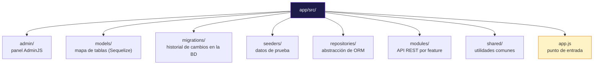

| Carpeta | Responsabilidad |
|---|---|
| `models/` | Define las tablas y sus columnas para Sequelize |
| `migrations/` | Historial versionado de cambios de esquema |
| `seeders/` | Datos de ejemplo para popular la base |
| `repositories/` | Capa que abstrae el ORM (Sequelize / Drizzle / Mongoose) |
| `modules/` | API REST organizada por entidad (routes → controller → service) |
| `admin/` | Configuración del panel AdminJS |
| `shared/` | Funciones reutilizables (manejo de errores, async) |
| `app.js` | Arranca Express, conecta todo |

---

## 2. Arranque de la aplicación (`app.js`)

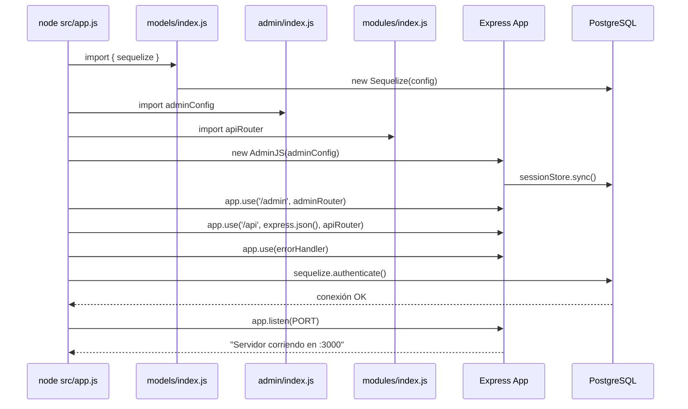

### Puntos clave de `app.js`

- **`/admin`** → todo el tráfico del panel AdminJS (usa `express-formidable` internamente)
- **`/api`** → la API REST propia, con `express.json()` aplicado **solo ahí** (para no romper AdminJS)
- **`errorHandler`** → middleware de 4 argumentos, siempre al final, captura errores de todas las rutas

---

## 3. Flujo de una request a la API REST

```mermaid
flowchart LR
    Client["Cliente<br/>(fetch / curl / Postman)"] -->|"GET /api/bebidas"| Router["modules/index.js<br/>(router central)"]
    Router --> Routes["bebidas.routes.js<br/>mapea verbo+path"]
    Routes --> Controller["bebidas.controller.js<br/>parsea req/res"]
    Controller --> Service["bebidas.service.js<br/>lógica + validación"]
    Service --> Repo["repositories/<br/>getRepositories()"]
    Repo --> ORM["Sequelize / Drizzle / Mongoose<br/>(según DB_DRIVER)"]
    ORM --> DB[("PostgreSQL")]
    DB -.->|"datos"| ORM
    ORM -.-> Repo
    Repo -.-> Service
    Service -.-> Controller
    Controller -.->|"JSON"| Client

    style Client fill:#fef3c7,stroke:#d97706
    style DB fill:#dcfce7,stroke:#16a34a
    style Repo fill:#ede9fe,stroke:#7c3aed
```

### Las 4 capas de cada módulo

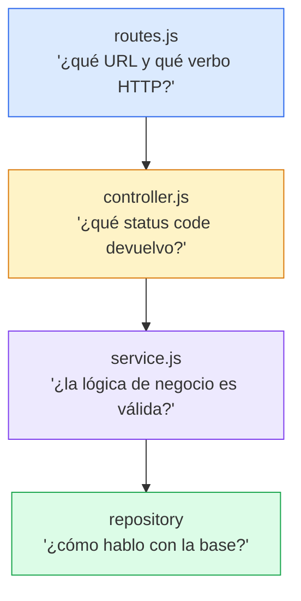

| Capa | Archivo ejemplo | Responsabilidad |
|---|---|---|
| Routes | `bebidas.routes.js` | Asocia `GET /` → `getAll`, `POST /` → `create`, etc. |
| Controller | `bebidas.controller.js` | Lee `req.params`/`req.body`, llama al service, devuelve `res.json()` con el status correcto |
| Service | `bebidas.service.js` | Valida datos, aplica reglas de negocio, llama al repository |
| Repository | `repositories/sequelize/...` | Traduce a consultas concretas del ORM activo |

---

## 4. Capa Repository — abstracción de ORM

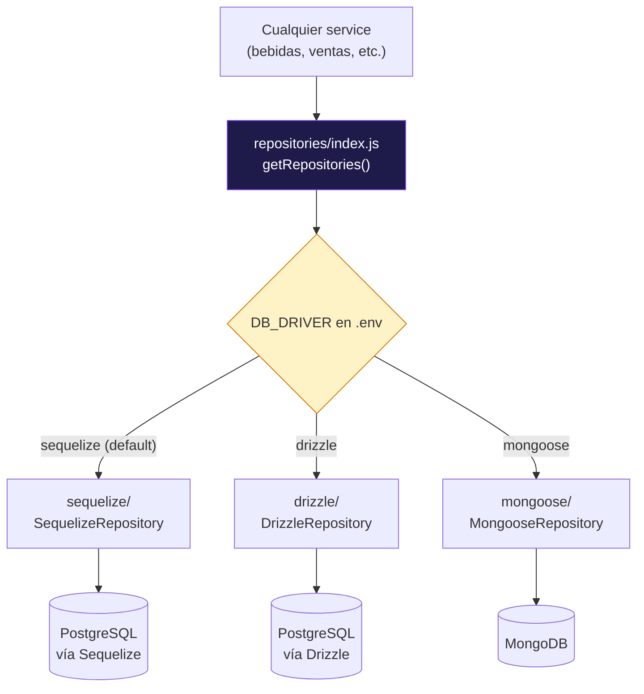

Cada implementación cumple el mismo contrato (`BaseRepository`):

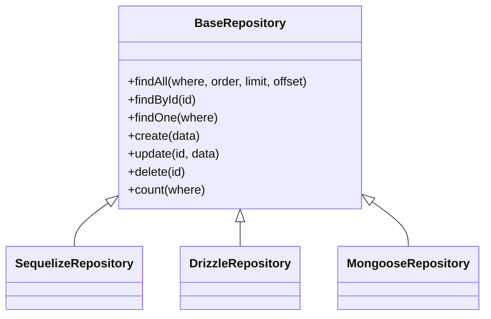

> El service nunca sabe qué ORM hay debajo — solo llama `repos.bebidas.findAll()`. Cambiar de motor de base de datos es cambiar una variable de entorno, no el código.

---

## 5. Modelos y relaciones (Foreign Keys)

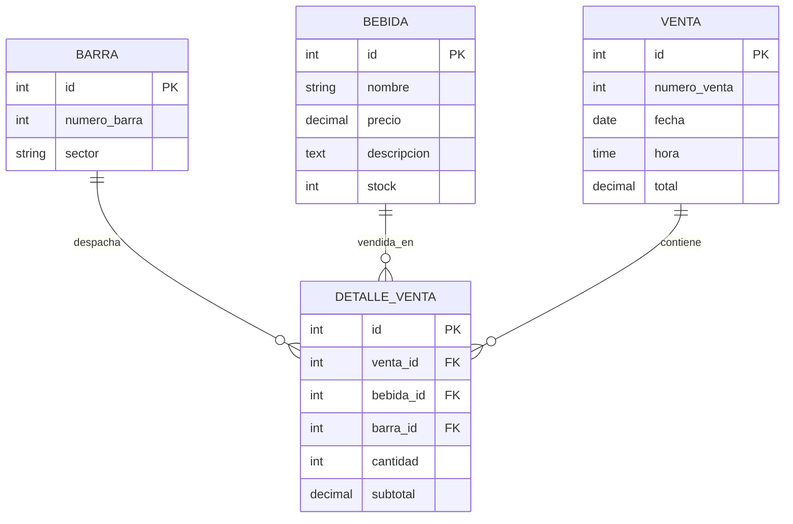

### Cómo se declaran esas asociaciones (`models/index.js`)

```js
Venta.hasMany(DetalleVenta,  { foreignKey: 'venta_id' });
DetalleVenta.belongsTo(Venta, { foreignKey: 'venta_id' });

Bebida.hasMany(DetalleVenta,  { foreignKey: 'bebida_id' });
DetalleVenta.belongsTo(Bebida, { foreignKey: 'bebida_id' });

Barra.hasMany(DetalleVenta,  { foreignKey: 'barra_id' });
DetalleVenta.belongsTo(Barra, { foreignKey: 'barra_id' });
```

---

## 6. Panel AdminJS — flujo paralelo a la API

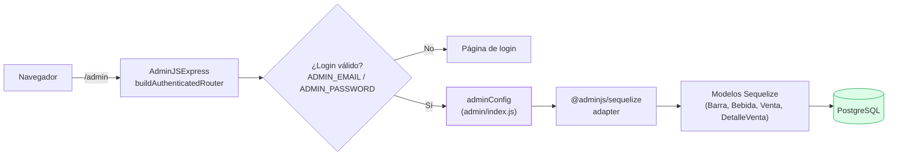

> **Importante:** AdminJS **no usa** la capa `repositories/`. Habla directo con los modelos Sequelize a través de su propio adapter (`@adminjs/sequelize`). Por eso, sea cual sea el `DB_DRIVER` elegido para la API, AdminJS siempre funciona sobre PostgreSQL vía Sequelize.

---

## 7. Migraciones y Seeders — ciclo de vida de la base

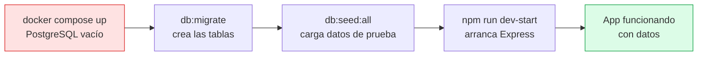

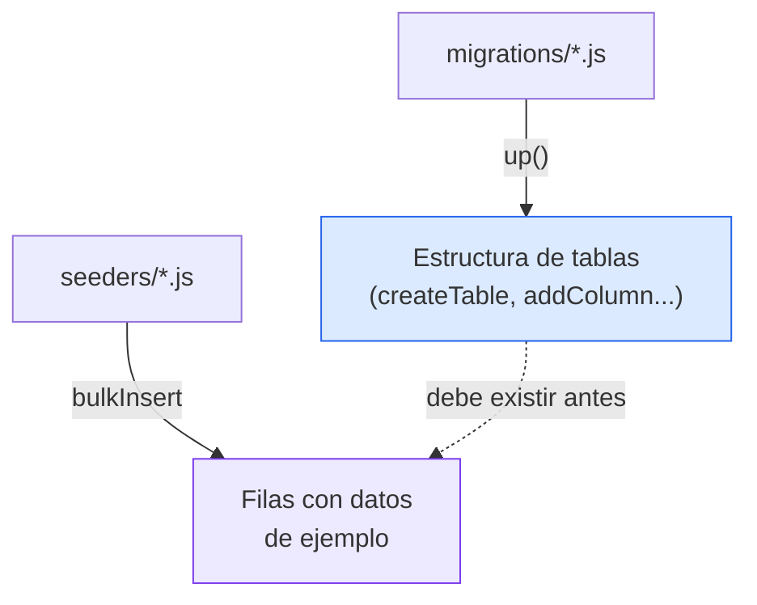

---

## 8. Manejo de errores (`shared/`)

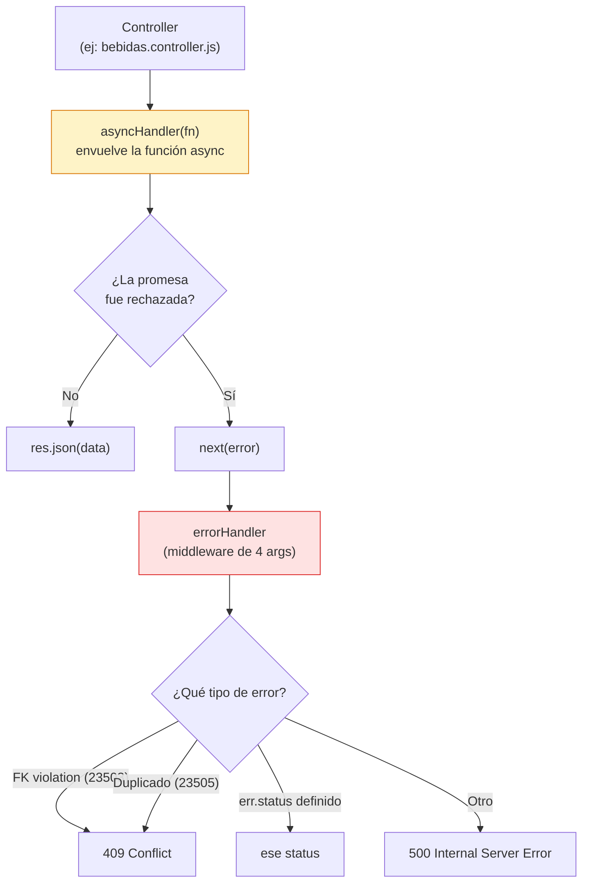

### Por qué existe `asyncHandler`

Express no captura automáticamente errores de funciones `async`. Sin este wrapper, una promesa rechazada dentro de un controller colgaría la request en vez de llegar al `errorHandler`.

```js
// shared/asyncHandler.js
const asyncHandler = (fn) => (req, res, next) =>
  Promise.resolve(fn(req, res, next)).catch(next);
```

---

## 9. Vista completa — toda la arquitectura junta

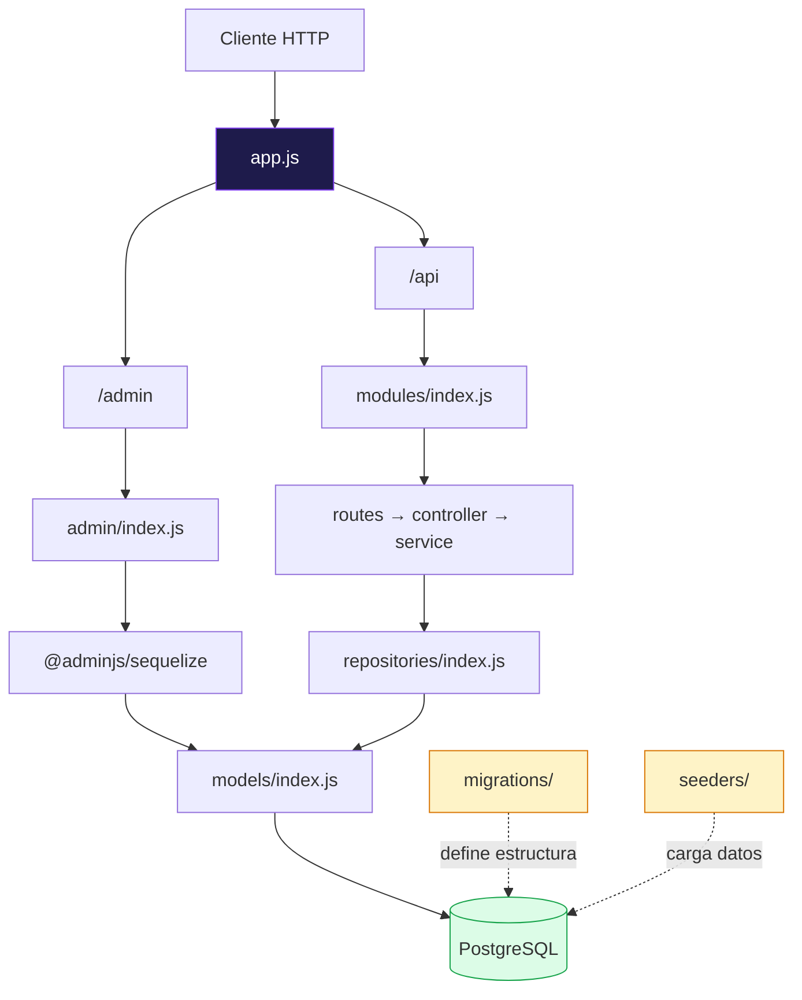
