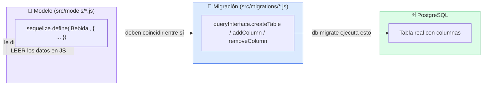
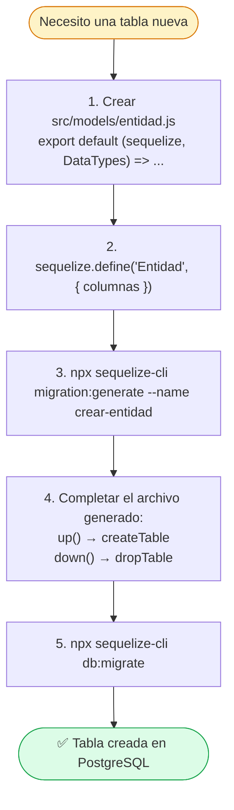
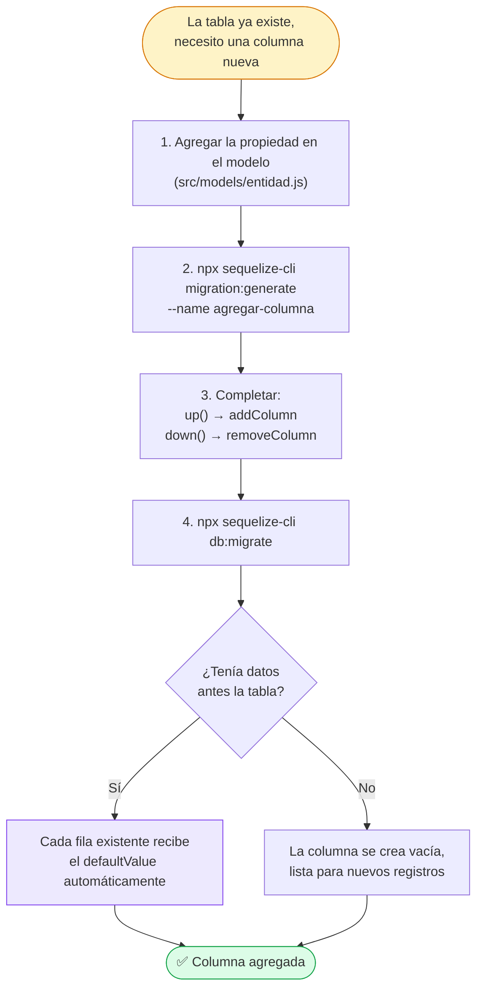
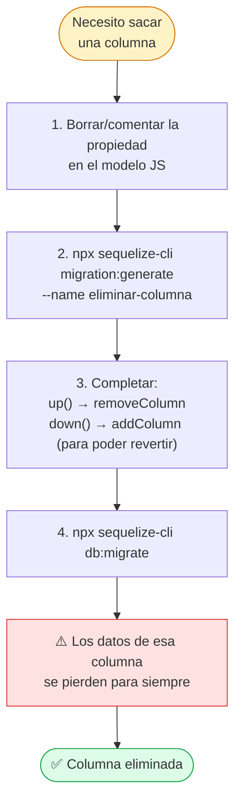
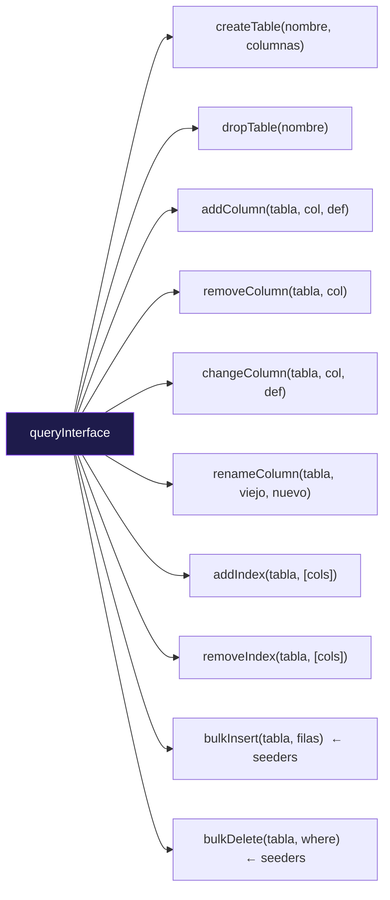
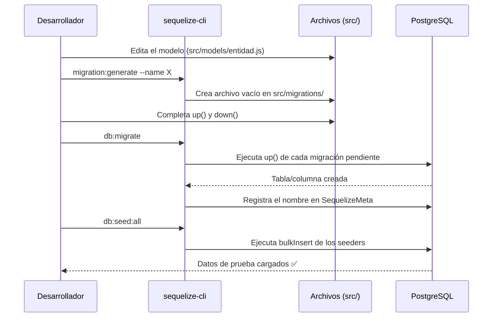
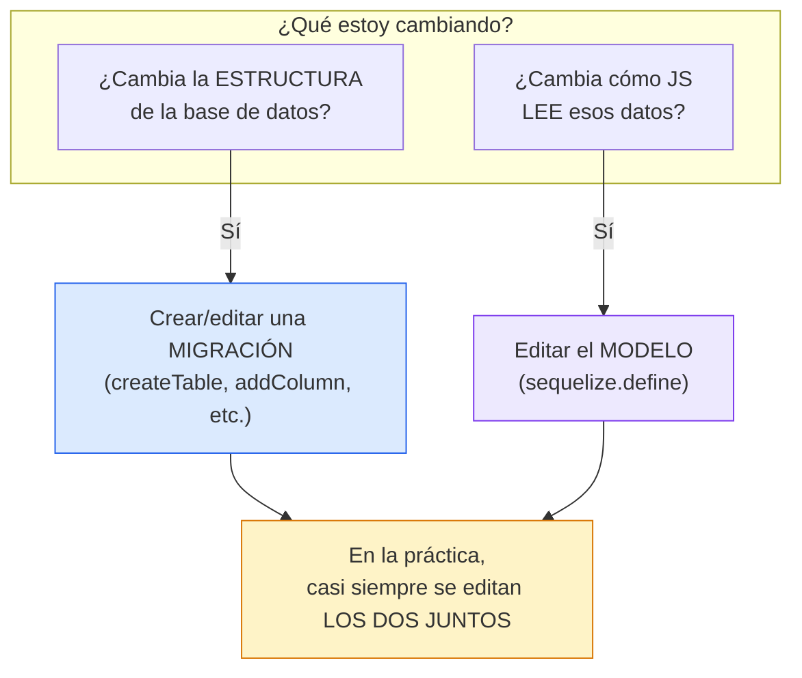

# Diagramas — Modelos y Migraciones en Sequelize

## 1. Relación entre Modelo y Migración



> **Regla de oro:** el modelo es el *mapa*, la migración es el *constructor*. Cambiar uno sin el otro deja todo desincronizado.

---

## 2. Crear una tabla nueva (modelo + migración)



### Código de referencia

```js
// up()
await queryInterface.createTable('bebidas', {
  id:     { type: Sequelize.INTEGER, autoIncrement: true, primaryKey: true },
  nombre: { type: Sequelize.STRING(200), allowNull: false, unique: true },
  precio: { type: Sequelize.DECIMAL(15, 2), allowNull: false, defaultValue: 0 },
});

// down()
await queryInterface.dropTable('bebidas');
```

---

## 3. Agregar una columna a una tabla existente



### Código de referencia

```js
// up()
await queryInterface.addColumn('bebidas', 'stock', {
  type: Sequelize.INTEGER,
  allowNull: false,
  defaultValue: 0,   // ← esto es lo que reciben las filas viejas
});

// down()
await queryInterface.removeColumn('bebidas', 'stock');
```

---

## 4. Eliminar una columna



### Código de referencia

```js
// up()
await queryInterface.removeColumn('bebidas', 'stock');

// down()  → para poder deshacer el cambio si hace falta
await queryInterface.addColumn('bebidas', 'stock', {
  type: Sequelize.INTEGER,
  allowNull: false,
  defaultValue: 0,
});
```

---

## 5. Otras operaciones comunes de `queryInterface`



| Método | Para qué sirve |
|---|---|
| `createTable` | Crear una tabla nueva con sus columnas |
| `dropTable` | Eliminar una tabla completa |
| `addColumn` | Agregar una columna a una tabla existente |
| `removeColumn` | Eliminar una columna |
| `changeColumn` | Cambiar el tipo o restricciones de una columna |
| `renameColumn` | Cambiarle el nombre a una columna |
| `addIndex` / `removeIndex` | Agregar/quitar índices |
| `bulkInsert` / `bulkDelete` | Insertar/borrar datos masivos (usado en **seeders**, no en migraciones) |

---

## 6. El flujo completo de comandos (de punta a punta)



---

## 7. Migración vs Modelo — quién hace qué


